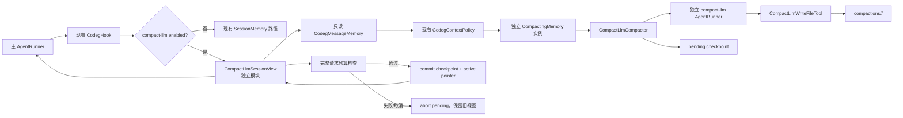

# Codeg Agent LLM 压缩支线（修订概要）

日期：2026-09-18  
状态：概要方案，尚未实施  
依据：Rig 0.42.0 `rig-memory` / `rig-agent` 源码，以及当前 Codeg `SessionMemory`、`LlmCompactor`、`CheckpointedCompactor`。  
关系：沿用 [codeg-agent-message-history.md](./codeg-agent-message-history.md)：摘要是派生压缩记录，不写入 `messages.jsonl`。

命名约定：Rust 模块使用 `compact_llm`，公开类型使用 `CompactLlm*`，配置或能力标识使用 `compact-llm`。本期只接入已持久化的主 Agent 会话。Subagent 仍是临时运行上下文，不写入主会话的消息或压缩目录。

## 1. 隔离原则

LLM 压缩代码放在独立的 `src-tauri/src/agent/context/compact_llm/` 模块中，默认关闭，采用可选适配器接入。以下现有功能保持原路径和原契约：

- `CodegMessageMemory` 的原始 JSONL 写入、恢复和 ordinal 幂等；
- `CodegHook`、主 Agent `AgentRunner`、主会话工具和 ACP 事件；
- 现有 `SessionMemory::load_history` 的非 LLM 压缩行为；
- Rig `CompactingMemory`、`CodegContextPolicy` 和主会话的取消/权限逻辑。

启用 `compact-llm` 时，主会话在请求边界显式选择新的 `CompactLlmSessionView`；关闭或配置缺失时继续使用现有路径。LLM 压缩通过只读的 `ConversationMemory` 读取原始消息，通过独立 checkpoint 保存派生摘要，不修改原始消息存储，也不把支线 tool call 交给主 Hook。

## 2. 结论

LLM 压缩是 `Compactor::compact` 的同步实现，不属于主 Agent 的工具回合。一次压缩遵循以下顺序：

1. `CompactLlmSessionView` 读取当前 pending prompt 之前的已确认原始 `Message`；System / preamble 不进入摘要输入。
2. 复用现有 policy 产生合法 `kept` 后缀和有序 `demoted` 前缀。`Compactor` 只接收尚未吸收的增量 `new_slice`，以及上一份 checkpoint artifact。
3. 独立 LLM 压缩 Runner 生成摘要，可通过受限文件工具把长材料写入本次 compaction 目录。
4. `CompactLlmCheckpointStore` 先写 `pending` checkpoint。候选 history 通过完整请求预算检查后，才原子切换为 `committed` 并更新活动指针。
5. 后续模型视图为 `[摘要 Message（含展开附件）] + kept`。摘要和附件不进入 `messages.jsonl`；原始消息仍完整保留。

摘要、附件、checkpoint 或预算检查失败时，保留此前活动 checkpoint 和原始消息。compact-llm view 丢弃本次内存状态后可重试，现有非 LLM 压缩路径不受影响。

## 3. Rig 契约

`ConversationMemory` 只保存原始有序 `Message`。`MemoryPolicy::apply_with_demoted` 输出 `kept` 与有序 `demoted`；`CompactingMemory` 只把尚未吸收的 `demoted` 增量传给 `Compactor`，再将 artifact 拼在 kept 前面。

LLM 压缩固定遵守 `evicted + carry_over` 增量契约，不能把整段历史重新塞进支线 Runner，也不能改写 kept。这样 `covers_through_seq`、checkpoint lineage 和 Rig 的 absorbed 水位保持一致。

Rig 不负责 checkpoint、活动指针、附件沙箱或重启恢复；这些由独立 LLM 压缩模块提供。LLM 压缩不修改 `CompactingMemory` 的源码，只实现新的 `Compactor` 和外层 `CompactLlmSessionView`。

## 4. 目标行为

| 项 | 约定 |
| --- | --- |
| 适用范围 | 主 Agent 持久化会话；Subagent 本期不接入 |
| 触发 | 请求预算需要压缩，且启用 `compact-llm` 摘要；模板卷滚只用于测试或显式配置 |
| 输入 | pending prompt 之前的原始消息；`Compactor` 实际收到增量 `new_slice` 和上一份 artifact |
| 输出 | 摘要 `Message`、附件 manifest 和 checkpoint artifact |
| 摘要落盘 | 只写 `compactions/<id>.json`，不写 `messages.jsonl` |
| 附件 | 只写本次 compaction 目录；清单记录相对路径、大小、SHA-256 和文本类型 |
| 原文 | `messages.jsonl` 只追加已确认原始消息，不删旧行、不混入派生消息 |
| 取消 | 每个主 turn 传入独立 compaction token；取消时支线停止并废弃 pending checkpoint |
| 最终预算 | 摘要、附件展开内容、kept、preamble、tool schemas 和当前 prompt 一起计入输入预算 |

## 5. 模块与接线

```text
src-tauri/src/agent/context/compact_llm/
  mod.rs                  CompactLlmSessionView 与公开配置
  branch.rs               独立 AgentRunner 和取消控制
  checkpoint.rs           pending/committed checkpoint 与恢复
  sandbox.rs              根目录限制、文件清单和完整性校验
```



`CompactLlmSessionView` 只在请求边界运行，并对同一会话串行 load。它不替换全局 `SessionMemory`，不向主 Hook 注册新的保存回调。主 turn worker 创建并传入 per-turn cancellation token，command loop 仍可处理 Cancel。

## 6. checkpoint 与恢复

目录结构：

```text
sessions/<cwd>/<session-id>/
  session.json                 身份、格式版本、活动 checkpoint
  messages.jsonl               原始确认消息，只追加
  runtime.jsonl                run 状态与追加收据
  compactions/
    <id>.json                  pending/committed checkpoint
    <id>/                      本次支线唯一可写根
      notes.md
```

`<id>.json` 字段：

- `id`、`previous_id`、`conversation_id`、`epoch`；
- `covers_through_seq`：已吸收原始前缀长度，1-based；
- `source_last_seq`：生成记录时原始消息的末尾序号；
- `source_slice_sha256`：本次交给内层 compactor 的增量 `new_slice` 哈希；
- `summary_message`：带固定历史摘要标记的标准 `Message::User`；
- `files[]`：`{path, bytes, sha256, media_type}`，路径必须相对本次 `<id>/`；
- `fingerprint`：摘要模型、compact prompt、计数策略和格式版本；
- `status`：`pending` 或 `committed`；
- `estimated_summary_tokens`、`created_at`。

`session.json.active_compaction_id` 是活动指针的权威来源。索引文件只能作为可重建缓存；启动时指针缺失或损坏，必须按校验通过的 lineage 修复，不能按目录枚举顺序猜测最新记录。

### 提交协议

1. 在 `<id>.pending/` 创建附件目录，逐个写入并 `flush + sync`；拒绝绝对路径、`..`、NUL、symlink、非 UTF-8 内容和超过硬上限的文件。
2. 计算摘要、附件和增量哈希，写入状态为 `pending` 的 checkpoint 临时文件并原子替换。
3. compact-llm view 构造候选 history，完成包含附件的完整请求预算检查。
4. 检查通过后，将 checkpoint 原子切换为 `committed`，再原子更新 `session.json.active_compaction_id`。
5. 启动恢复时，废弃 pending 记录和孤立附件目录；若已提交记录存在而活动指针未更新，验证 lineage 后补写指针。

原始 `messages.jsonl` 不参与这笔派生事务，因此压缩失败不会产生原始消息尾部、ordinal 或运行恢复问题。相同的 `conversation_id + epoch + covers_through_seq + source_slice_sha256 + fingerprint` 可复用已有 pending/committed 记录，避免重复调用 LLM。

### 加载

1. 读取原始 `messages.jsonl`，按 pending 边界排除当前 prompt。
2. 读取并校验活动 checkpoint 链的 epoch、fingerprint、`source_last_seq` 和每个增量哈希。
3. 将活动 checkpoint 的 `covers_through_seq` 绑定到 compact-llm view 的 policy，阻止已摘要前缀回到 kept。
4. 通过独立 `CompactingMemory` 加载：精确命中 checkpoint 时不调用 LLM；有新 demoted 增量时只压缩该增量。
5. 按 manifest 读取附件，校验路径、大小、SHA-256 和 UTF-8；内容作为同一摘要 User Message 的后续 `UserContent::Text` 加载。
6. history 固定为 `[summary_message_with_files] + seq > covers_through_seq 的原始后缀`。没有活动 checkpoint 时，history 是合法的原始 kept。
7. 当前 prompt 始终单独作为 `.runner(prompt)`，不写入本次 history，也不送给 LLM 压缩支线。

epoch、fingerprint 或哈希不匹配时，旧记录保留为历史，但不参与当前视图；在串行边界创建新 epoch，重新从原始消息建立压缩链。

## 7. 独立压缩支线

`CompactLlmCompactor` 对外实现 Rig `Compactor`，内部使用独立 Runner。它的输入是 `new_slice` 和上一份摘要，不是主会话完整 history。

- 独立 AgentBuilder 使用同一 `CodegLlmClient` 和 compact 模型，但使用专用 preamble；源消息按不可信数据处理。
- 只注册 `CompactLlmWriteFileTool`，根目录固定为 `compactions/<id>/`。不复用主会话 `write_file`，不注册 bash、MCP、skills、subagent 或主 `SessionMemory`。
- 工具只接受相对路径，拒绝 `..`、绝对路径、symlink 和非 UTF-8 内容；单文件、文件数和总字节数均有硬上限。
- 支线轮次、输入字节数、输出 token 数和 deadline 单独配置；超过上限返回可恢复错误。
- 结束时取最终助手文本，校验非空、摘要格式、manifest 和引用路径；摘要与附件展开内容必须通过最终预算检查。
- 每次调用使用 `CompactionControl` 绑定的 per-turn token。主 turn 取消或 session shutdown 时，支线停止，pending checkpoint 不得激活。

摘要通过 checkpoint 的精确 ID 定位，不通过 User Message 文本前缀猜测。真实用户消息即使包含相同文字，也必须原样保留。

## 8. history 与预算

```text
history = [ summary_message_with_files ] + kept
```

- 摘要来自已验证 checkpoint，不写入 `messages.jsonl`；
- 附件作为同一摘要 User Message 的后续文本内容加载，展示和预算计算使用同一格式；
- kept 是 policy 保留的最近合法原始后缀，支线不重写工具调用、工具结果或 pending 保护范围；
- System 只来自 Agent preamble，不进入原始 JSONL 或 LLM 压缩输入。

最终预算必须覆盖 preamble、tool schemas、摘要、附件、kept 和当前 prompt。检查失败时只废弃当前 pending checkpoint，保留旧活动链；下一次 load 可以重试或返回明确的 `context_budget_exceeded`。

## 9. 实施改动面

1. 新增 `context/compact_llm/` 模块和 opt-in `CompactLlmSessionView`；默认配置不改变现有路径。
2. `CompactLlmCompactor`：复用 `evicted + carry_over` 契约，使用独立 Runner、受限文件工具、独立轮次和 per-turn 取消。
3. `CompactLlmCheckpointStore`：实现 pending/committed 两阶段事务、增量哈希、附件 manifest、fingerprint/epoch 校验和 checkpoint 命中恢复。
4. 在主 turn worker 的请求边界增加一次适配器选择；不改 `CodegMessageMemory` 的 JSONL 格式，不改 `CodegHook` 的主 run 保存回调，不让派生 artifact 进入 run ordinal。
5. `SessionMemory` 只增加可选入口或构造参数；未启用 compact-llm 时复用原实现。compact-llm view 自己持有 policy、wrapper 状态和 load lock，避免改变现有 session wrapper 的生命周期。
6. Subagent 保持 `session_memory: None`；后续若接入，必须先定义独立 session/epoch 和存储边界。

## 10. 验收用例

- LLM 压缩成功后 `messages.jsonl` 只有原始消息，checkpoint 含摘要和附件 manifest；
- 同进程连续 load、重启后 load、以及当前原文恰好未触发 token demotion 时，都不会重复调用 LLM 或恢复已覆盖前缀；
- 多轮滚动压缩按增量 hash 命中 lineage，附件在下一轮 carry-over 中仍可恢复；
- 摘要、附件、checkpoint 或活动指针写入中途崩溃后，旧活动链仍可加载，pending 记录不会生效；
- 摘要加附件导致最终请求超预算时，新 checkpoint 不激活，下一次可重试或明确失败；
- `../x`、绝对路径、symlink、超大文件和超大目录均被拒绝；
- 用户消息包含“历史摘要”文字时仍原样保存；
- 主 turn Cancel 能中止 LLM 压缩，且不留下活动 checkpoint；
- Subagent 不会写入主会话 messages 或 compactions；
- 工具调用/工具结果配对、pending prompt 排除和原始 Message round-trip 继续通过现有测试。

主 Agent 权限、主会话工具并发和 40 轮默认值不改。
