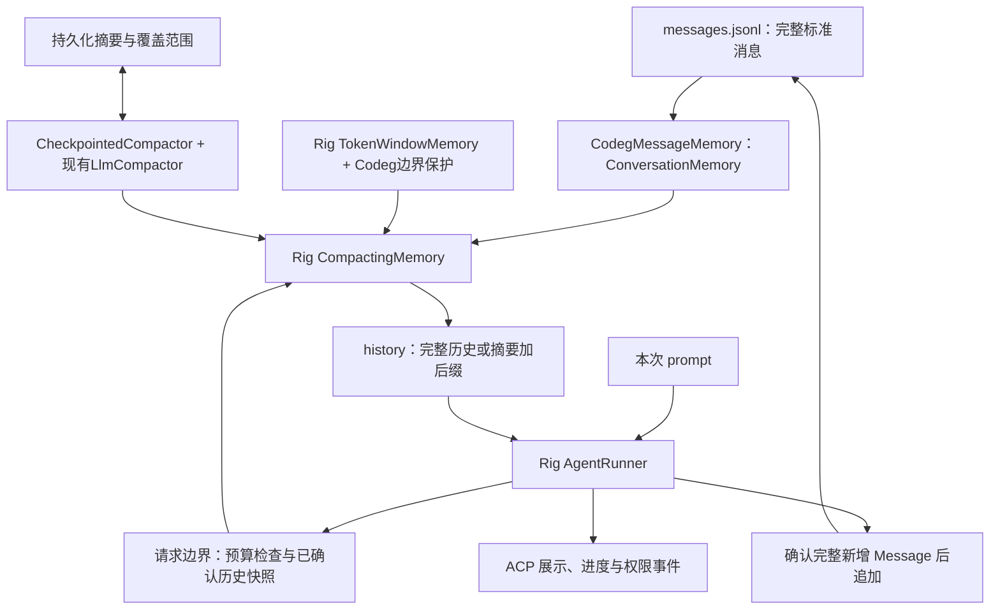

# Codeg Agent 标准消息存储与上下文压缩方案

日期：2026-09-17  
状态：设计方案，尚未实施  
适用范围：基于 Rig 0.42.0 的 Codeg 内置智能体，覆盖桌面与服务器共用运行路径。

## 1. 设计结论

Codeg Agent 的会话正文统一保存为 **Rig 标准 `Message` 的有序序列**，内存类型为 `Vec<rig::completion::Message>`。本地存储实现 Rig 的 `ConversationMemory` 接口，上层直接组合 `TokenWindowMemory`、`CompactingMemory` 和 `Compactor`。执行时加载该组合返回的 messages，作为 history 传给 Rig；本次指令单独作为 prompt。执行过程中由 Rig 维护模型回复、工具调用和工具结果的顺序，Codeg 将确认后的新增消息可靠追加到本地。

**正常执行不重新构造历史，不删减早期消息。达到上下文预算阈值后，才选取合法消息边界，把旧前缀压缩为摘要，再用“摘要 + 保留的原始后缀”继续执行。** 完整原始 messages 保留，压缩只改变模型使用的上下文视图。

Rig 已提供窗口裁剪、保留/移出消息分流、滚动摘要、摘要承接和归档扩展点。本方案直接复用这些能力；Codeg 只补本地持久化、请求预算与 pending 消息保护、摘要检查点、长 run 的触发接线，以及模型摘要实现。批次和工具执行状态保留为运行元数据，不再承担正文重建职责。

已核实：`rig-memory` 0.42.0 自带的是无 LLM 的 `TemplateCompactor`，LLM 摘要通过 `Compactor` 扩展；Codeg 当前已经实现 `LlmCompactor: Compactor`。本次应改造和复用该实现，不从零再建压缩框架。

## 2. 依据与现有问题

### 2.1 Rig 的会话约定

Rig 的 Agent 配置本身不保存每次调用的对话。调用方可以显式传 history，也可以使用自动 conversation memory。`chat` 会追加本次消息，手动传入 history 的调用则需要调用方管理保存，不能重复追加。参见 [Conversations and memory](https://rig.rs/docs/concepts/agent#conversations-and-memory)。

Rig 的 `Message` 支持 serde，适合作为本地持久化格式；自动 memory 在加载时返回历史，在成功结束后追加消息，显式 history 会绕过该自动机制。窗口策略、滚动摘要和可扩展 LLM compactor 已在 [Bounding history with policies](https://rig.rs/docs/concepts/memory/#bounding-history-with-policies) 中给出。Codeg 可以显式调用这些 memory 对象，同时自己确认保存结果。

Codeg 继续使用 `AgentRunner` 驱动模型与工具循环。显式 `.history(...)` 的入口满足本方案，工具并发时仍应遵循 Rig 最终消息顺序。参见 [AgentRunner](https://rig.rs/docs/concepts/agentrunner)。

官网部分页面面向 main 分支，其示例中的 `OneOrMany`、`Flow` 等写法与本地锁定版本存在差异。以下类型、API 和保存边界以 `src-tauri/Cargo.toml` 锁定的 **0.42.0** 及对应源码为准，不直接照搬网页示例。

### 2.2 Rig 能力复用清单

以下行为已核对本地锁定的 `rig-memory` 0.42.0 源码。它已在项目依赖中，无需新增另一个 memory 框架。

| Rig 能力 | 现有作用 | 本方案的用法 |
| --- | --- | --- |
| `ConversationMemory` | `load/append/clear`，正文类型是标准 messages | 本地 JSONL 存储直接实现该接口；加载和关键保存由 Codeg 显式调用 |
| `MemoryPolicy::apply_with_demoted` | 返回 `(kept, demoted)`；demoted 必须是原输入的有序前缀 | 直接取得保留后缀和摘要输入，不再先切 `CanonicalTurn` 再反推 messages |
| `NoopMemoryPolicy` | 原样返回输入 | 尚无活动摘要且未触发阈值时可直接使用 |
| `SlidingWindowMemory` | 按最近消息数量裁剪，处理窗口首条孤立工具结果 | 用于确定性测试、明确配置的消息数量策略；不作为编码会话默认预算 |
| `TokenWindowMemory` | 使用 `TokenCounter` 从尾部选取预算内消息 | 作为默认窗口算法，Codeg 只追加安全切点与当前 pending 保护 |
| `HeuristicTokenCounter` / `TokenCounter` | 现成估算器及可替换计数接口 | 先复用启发式计数；后续可换精确 tokenizer，不改窗口策略 |
| `PolicyMemory` | 在 load 时应用策略并传播错误，append 交给原存储 | 用于只需要窗口而不需要摘要的调用点和测试 |
| `IntoFilter` / `with_filter` | 把策略接到内存后端；策略失败返回未过滤历史并告警 | 适合示例和宽松过滤；本任务硬预算路径使用可传播错误的接口 |
| `CompactingMemory` | 执行策略、只摘要新移出的前缀、传入旧摘要、返回摘要加 kept；维护进程内水位 | 直接作为主路径的压缩组合器，不再自写 L1/L2 升级状态机 |
| `Compactor` / `carry_over` | 扩展摘要生成，旧摘要通过参数承接 | 复用 Codeg 现有 `LlmCompactor`，增加检查点装饰器 |
| `TemplateCompactor::with_max_bytes` | 无模型的文本滚动汇总，可设置字节上限 | 用于测试和明确选择的非 LLM 模式；不能当作等价的语义摘要 |
| `DemotingPolicyMemory` / `DemotionHook` | 把新移出消息送到归档/长期记忆，具有进程内投递水位 | 有冷索引或检索需求时复用；完整原文已在 JSONL，本期不重复归档 |

默认链路选择 `CompactingMemory`，不把以上所有 wrapper 顺序套一遍。尤其不能先用内层 `PolicyMemory` 裁掉旧消息，再让外层 `CompactingMemory` 摘要：外层将看不到被内层丢掉的原文。归档与摘要如需同时执行，应共享同一份 demoted 输入。

### 2.3 Codeg 已有能力与本次差距

`src-tauri/Cargo.toml` 已同时锁定 `rig` 与 `rig-memory` 为 0.42.0。`context/compact.rs` 已使用 `MemoryPolicy`、`SlidingWindowMemory`、`TemplateCompactor`，并在第 180 行实现 `Compactor for LlmCompactor`。

现有 LLM 压缩使用一个最多 8 个模型轮的内置 agent，可挂 `read_file/write_file/glob` 写摘要文件；外部仍通过自定义 `CanonicalTurn`、L1/L2 等级和硬丢弃逻辑组织输入。问题是接入方式和正文模型，不能概括为“Rig 没有压缩”或“Codeg 没有 LLM 摘要”。

本次保留供应商客户端、摘要模型选择、compact prompt 和取消支持；改为标准 messages 输入与 Rig wrapper 组合，默认用一次无工具 completion 生成摘要，替换整套带工具的摘要子循环。

### 2.4 现有实现为什么要改

2026-09-17 的 switchgear 会话累计执行 160 轮模型调用、383 次独立工具调用，四次用户指令都在 40 轮后错误结束，没有执行 `git add` 或 `git commit`。调查发现以下直接相关问题：

| 现有实现 | 后果 | 本方案的处理 |
| --- | --- | --- |
| `CanonicalTurn.assistant` 只保存一个回复，每个模型批次重新赋值 | 同一指令前面的回复及其工具结果不再进入请求 | 按发生顺序追加标准 messages |
| 每次请求用 `ContextStore` 投影覆盖 Rig history | Rig 已维护的完整执行历史被残缺投影替换 | 正常路径直接沿用 Rig history |
| 投影包含 pending prompt，Rig 又追加一次 | 用户输入或末批工具结果重复 | history 与 current prompt 明确分离 |
| ACP UI 更新混合 `model_commit` 与工具元数据 | 写入与恢复契约不一致，完整内容不能可靠还原 | messages 保存正文，ACP 仅作为展示事件 |
| batch ID 使用工具数量生成 | 多批次标识碰撞 | 持久化定位使用消息序号与独立 run ID |

对应当前代码入口：[store.rs](../../src-tauri/src/agent/context/store.rs)、[budget.rs](../../src-tauri/src/agent/context/budget.rs)、[hook/mod.rs](../../src-tauri/src/agent/hook/mod.rs)、[hydrate.rs](../../src-tauri/src/agent/context/hydrate.rs)。本方案替换其中的正文模型与历史组装方式。

## 3. 职责与数据流



| 组件 | 职责 |
| --- | --- |
| `CodegMessageMemory` | 实现 `ConversationMemory`；读取、追加标准消息，复用本地锁与确认游标 |
| `RunRecorder` | 关联 Rig 新增消息与磁盘序号，管理增量保存、失败和取消收口 |
| Rig `TokenWindowMemory` | 执行窗口选取算法，输出 kept/demoted |
| `CodegContextPolicy` | 实现 `MemoryPolicy`，组合 Rig token 策略，仅补触发阈值、安全边界和当前 pending 保护 |
| Rig `CompactingMemory` | 调用 policy 和 compactor，复用滚动摘要、水位、carry_over 与摘要拼接 |
| `CheckpointedCompactor<LlmCompactor>` | 复用 `Compactor` 接口；缓存/持久化摘要，必要时调用现有 LLM 摘要器 |
| `CodegHook` | 权限、展示与保存接线；请求边界显式调用 memory，实际压缩后才覆盖 history |
| `AgentRunner` | 维护本次运行的标准消息顺序并驱动模型、工具循环 |
| ACP 展示适配器 | 从标准消息与执行状态生成现有 UI 内容，不作为执行历史来源 |

继续保持宿主、会话壳、Rig 能力层的既有边界。`Message` 类型留在内置 agent 模块内，不要求外部 ACP 智能体改变存储格式，也不把新的模型循环放进 `acp/connection.rs`。

组合关系如下。标有 Codeg 名称的类型及构造参数属于拟新增适配；`CompactingMemory`、`TokenWindowMemory`、`HeuristicTokenCounter` 使用 Rig 原有能力：

```rust
let policy = CodegContextPolicy::new(
    TokenWindowMemory::new(tail_budget, HeuristicTokenCounter::openai()),
    request_scope,
);
let context_memory = CompactingMemory::new(
    codeg_message_memory,
    policy,
    CheckpointedCompactor::new(llm_compactor, checkpoint_store),
);
let history = context_memory.load(&conversation_key).await?;
// 将 history 交给 runner(current_prompt).history(history)。
```

实际 policy 每次读取本会话的预算快照，以适应当前 prompt、schemas 和模型窗口变化；同一会话内保持一致的不可变请求快照并串行 load。复用同一个 `CompactingMemory` 实例，不能每个模型轮重新构造而丢掉进程内水位。会话关闭时调用 `forget` 释放缓存；它只清 wrapper 状态，不删除消息。分叉或原历史变更使用新的 conversation key/epoch，避免复用旧水位。

## 4. 标准 messages 的格式

### 4.1 采用 Rig 的序列化格式

“标准格式”在本方案中具体指 **Rig 0.42.0 `rig::completion::Message` 的 serde 格式**。它是框架的跨供应商消息类型，发送 HTTP 时再由 Rig provider adapter 转换。

| 内容 | Rig 内部表示 |
| --- | --- |
| 系统消息 | `Message::System`，字符串 content |
| 用户输入 | `Message::User`，`Vec<UserContent>` |
| 模型回复 | `Message::Assistant`，保留 provider message ID 和 `Vec<AssistantContent>` |
| 工具调用 | assistant content 中的 `ToolCall` |
| 工具结果 | user content 中的 `ToolResult` |
| 图片、文档、音频、reasoning | 保留对应标准 content 类型，不转换为纯文本 |

Rig 0.42.0 的 content 标签是 `toolcall`、`toolresult`；持久化不能另造 `role: "tool"`，也不能只保留最终回复文本。HTTP Chat Completions 的 `role: tool`、Responses 的 `function_call_output` 均属于 provider 层格式。

下面是一个完整消息片段的 JSON 数组表示；实际 JSONL 文件每行写一个对象。示例调用 ID 为虚构标识，字段形态按锁定版本定义。

```json
[
  {
    "role": "user",
    "content": [{ "type": "text", "text": "提交当前改动" }]
  },
  {
    "role": "assistant",
    "id": null,
    "content": [
      {
        "type": "toolcall",
        "id": "call_status_01",
        "provider": { "call_id": "call_status_01" },
        "function": {
          "name": "bash",
          "arguments": { "command": "git status --short" }
        },
        "signature": null,
        "additional_params": null
      }
    ]
  },
  {
    "role": "user",
    "content": [
      {
        "type": "toolresult",
        "call": "call_status_01",
        "provider": { "call_id": "call_status_01" },
        "name": "bash",
        "content": [{ "type": "text", "text": "exit_code: 0\n M README.md\n" }]
      }
    ]
  },
  {
    "role": "assistant",
    "id": null,
    "content": [{ "type": "text", "text": "已确认改动范围。" }]
  }
]
```

实现必须直接序列化整个 `Message`。保留工具的 `id`、`provider.call_id`、`provider.item_id`、函数名、参数、签名和 additional params；保留 reasoning 的 provider ID、签名及不透明内容。不能用自定义 `AssistantPart::Text/ToolCall` 枚举挑选字段后重建。升级 Rig 或迁移格式时，除反序列化成功外，还应检测读取后重新序列化是否丢字段；对未知版本不能静默按当前类型读取并覆盖原文件。

### 4.2 正文与运行配置的边界

会话正文记录实际接受的用户输入、模型回复、工具调用与模型可见结果。系统 preamble、工具 schemas 和每次加载的工作区规则按运行配置生成，记录其版本或哈希供追溯，在请求中只注入一次。迁移旧数据时如已有 system message，必须指定唯一注入来源。

图像等附件要保留可恢复的标准内容。若原输入依赖临时文件，接受输入时先转成稳定的文件数据或持久化资源，再生成 Rig 支持的 Message；不得把无法解析的自定义路径塞入 content 后声称能直接加载。

工具执行的原始大输出可以继续写 spills。标准 tool-result 保存 **实际交给 Rig 的呈现内容**，包含真实调用 ID 和原输出定位。工具自身明确的输出上限属于工具返回契约；它必须显式标记截断。历史中已有消息的再次缩减则属于上下文压缩，只能在预算流程中发生，不能每次加载都偷偷裁剪。

## 5. 本地文件结构与写入

复用现有 `codeg_agent_sessions_root()` 和 cwd 分组，新版每个会话使用独立目录：

```text
codeg-agent/sessions/<encoded-cwd>/<session-id>/
  session.json                 会话身份、格式版本、确认游标、当前压缩记录
  messages.jsonl               每行一个完整 Rig Message，只追加
  runtime.jsonl                run 状态、追加事务、工具执行收据及消息位置
  compactions/
    <compaction-id>.json       摘要消息、覆盖范围及校验信息
```

spills 和附件可复用既有目录。旧 `<session-id>.jsonl` 保留为迁移输入，不原地覆盖。

**messages.jsonl 是已确认会话正文的唯一来源。** 读取若干行反序列化后就是 `Vec<Message>`；执行层不需要从 runtime 或 ACP 事件重建正常会话。runtime 不复制另一份完整对话，只保存运行状态、序号映射、幂等键及执行收据。异常恢复需要补齐的缺失工具结果另见第 9 节。

元数据示例，字段为本方案拟新增结构：

```json
{
  "storage_version": 2,
  "message_format": "rig::completion::Message",
  "rig_version": "0.42.0",
  "session_id": "session-example",
  "cwd": "/workspace/project",
  "committed_message_count": 48,
  "active_compaction_id": null
}
```

每条 Message 的 `seq` 由已确认文件中的物理行序号定义，从 1 开始，不写入 Message 对象。`run_id` 为独立 UUID，runtime 记录它对应的 seq 区间和本次消息 ordinal。provider ID 仅保留供应商赋予的含义，不用它充当本地幂等键，也不按正文文本去重。

写入协议复用当前单会话写锁，确保正常保存、压缩、迁移、回退不会并发改同一会话。每次追加采用明确的确认边界：

1. 记录追加准备项：operation ID、run ID、ordinal 区间、预期文件偏移、消息数量与内容哈希。
2. 追加完整 Message 行，flush 并按持久化策略 sync。
3. 写入提交项并确认，再推进元数据中的消息游标；元数据文件通过临时文件和原子替换更新。
4. 重启遇到 prepare 未提交时，按偏移、长度和哈希核对：完整一致可补确认；不完整则隔离未确认尾部，不能把截断 JSON 当作正文。

幂等以同一追加 operation 或 `(run_id, message_ordinal)` 为准。进程内流式通知重发不得产生重复消息；用户在新指令中重复相同文本仍是合法新消息。

## 6. 执行时怎样加载和保存

### 6.1 开始新指令

取得会话写锁并处理未完成恢复后，记录本次 `run_id` 和开始位置。`CodegMessageMemory.load` 提供本次 prompt **之前**的完整已确认原始 messages；外层 `CompactingMemory.load` 再按策略返回完整历史，或摘要与保留后缀。原文后端不预先裁剪，也不混入摘要。

本次输入可以先可靠落盘，再发模型；但为本次 Runner 构造 history 时必须用接受输入之前的边界，把这条输入排除。读取磁盘末尾后直接再传同一 prompt 会导致重复。

接线示意如下，`run_recorder`、`request_scope` 和 `request_guard` 是本方案拟新增接线；`context_memory` 是第 3 节组合的 Rig `CompactingMemory`，代码仅表达调用关系：

```rust
let run = run_recorder.begin_run(session_id, &current_prompt).await?;
request_scope.bind_history_before(run.prompt_seq, &current_prompt)?;
let history: Vec<Message> = context_memory.load(&conversation_key).await?;
request_guard.check(&history, &current_prompt)?;

let stream = agent
    .runner(current_prompt)
    .history(history)
    .max_turns(max_turns)
    .add_hook(codeg_hook)
    .stream()
    .await;
```

### 6.2 正常多轮执行

Rig 自己追加本次消息：`prompt → assistant → tool results → assistant ...`。普通 completion hook 只检查预算、记录诊断和处理已有宿主功能，**不设置 history patch**。只有 max_tokens 等其他参数需要覆盖时，也不得顺便设置空 history。

Codeg 的原文缓存与磁盘 messages 保持同一格式。运行内用 Rig 的消息流推进；请求边界更新已确认原文快照并显式调用同一个 memory 组合，解决 Rig 自动 memory 只在 run 开始 load 的限制。未发生裁剪时沿用 Rig 原 history；已使用压缩视图时按第 8 节应用该视图。快照可以由追加缓存提供，不要求每轮重新扫描磁盘全文件。

### 6.3 保存完整新增消息

Rig 0.42.0 的 `FinalResponse.messages()` 包含本次 run 的新增消息，包含当前 prompt、所有工具轮和最后回复，不包含传入的旧 history。成功收口时应核对已增量保存的前缀，再追加剩余部分。不能用它覆盖整个会话，也不能在已保存 prompt 后再次无条件追加整个返回值。

正文不能只等成功结束才落盘。保存边界如下：

| 时机 | 正文保存行为 | 运行状态 |
| --- | --- | --- |
| 接受用户指令 | 保存当前标准 user Message 一次 | run started、prompt_seq |
| 模型回复被接受、执行工具前 | 保存完整 assistant Message，包含同轮全部调用和完整 content | model step、对应消息位置 |
| 工具执行中 | 不把进度 chunk 追加成正式回复 | started、输出定位、终态收据 |
| 同轮工具完成，下一次模型请求前 | 按 Rig 顺序保存完整 tool-result Message | 工具组已收口 |
| 最终回复 | 保存完整 assistant Message，并与本次最终 messages 校验 | run completed |
| 错误或取消 | 保留已确认消息和执行事实；补充真实失败状态 | run failed/cancelled，具体错误码 |

流式文本 delta 和参数 delta 用于 UI，不逐个写成 `Message`。失败前的未完成文本可留展示日志，但必须标明不完整，不伪装为已接受模型回复。

### 6.4 Rig 0.42.0 的接入限制

普通路径可在 `on_completion_call` 观察 `event.history + event.prompt`，按 run 基线与新增消息游标核对；这里的 prompt 可能已经是工具结果。history 可能含派生摘要，不能把这份请求历史整体追加回原始 messages。正文保存使用 Rig 本次 run 的新增序列，摘要只在 compaction artifact 中持久化。

执行前保存还要覆盖工具调用修复、模型重试和取消。`on_model_turn_finished` 位于接受决策阶段；工具修复等恢复路径可能不触发它。单个 `on_tool_result` 回调的完成顺序也可能不同于最终消息顺序。因此实现不能仅把这两个回调当作完整持久化合同。

锁定版本现有公开 hooks 不能完整提供上述执行前保存边界。本方案明确增加一个薄的 **committed-messages checkpoint**：由 Rig 驱动器暴露本次 run 已提交的标准 `run.messages()`，Codeg 按已确认 ordinal 追加新消息，返回持久化确认后才进入下一步。

建议接入共享 `drive_agent` 在 `run.next_step()` 返回之后、分发 `CallTools`、`CallModel` 或 `Done` 之前的边界。此时已接受的 assistant 已进入标准序列，工具尚未执行；工具组完成后，下一步又能取得 Rig 排好序的结果。终端错误分支也需要保存已经提交的消息，避免 40 轮上限在发出下一模型请求前报错，漏掉上一批工具结果。

该检查点是拟新增框架接入契约，不是 0.42.0 已有公开 API。通过仓库可追踪、固定版本的依赖补丁或受控 fork 实现，不能直接修改本机 Cargo 缓存。它仅增加确认回调，继续由 Rig 管理消息顺序、工具组、重试及模型循环；不从 `on_model_turn_finished` 或单个工具事件重新拼一份正常正文。该修改用于工具副作用前的持久化确认，memory policies、`CompactingMemory` 和 LLM compactor 的复用本身不要求修改 Rig。

这是切换新版持久化的前置验收项，必须用工具修复、模型重试、并发、取消和写入失败测试证明时序。Codeg 应在消息保存确认后再宣布 run 完成。

### 6.5 复用 ConversationMemory，显式控制执行边界

本方案现在就实现和复用 `ConversationMemory`，并调用 `CompactingMemory.load`。选择显式调用的原因是：本地 0.42.0 自动 append 主要走成功结束路径，错误或取消不会等价保存完整进展；append 失败可能只记录警告；一个长 run 内也不会在每个模型轮自动重新 load。

这些是自动生命周期的边界，不是放弃 Rig memory 组件的理由。Codeg 显式调用组合器 load，验证后交给 `.history(...)`；RunRecorder 向同一原文后端追加并等待确认。`.history(...)` 绕过的是 Agent 自动 memory，不会撤销此前显式执行的 policy/compactor。不要同时启用 `.memory(...).conversation(...)` 自动保存而产生第二个写入者。

当前 Cargo 注释限制的是旧用法，实施时应更新为新的“复用 memory 组件、显式控制确认与请求边界”约定；无需更换依赖版本来使用上述已有能力。

## 7. 压缩触发与切割规则

### 7.1 什么时候压缩

每次模型请求前做预算检查，但未触发时消息原样使用。估算覆盖 preamble、工具 schemas、历史、当前 prompt、多模态内容及协议开销，当前 prompt 只计一次。

复用 `HeuristicTokenCounter` 作为消息计数器，通过 `TokenCounter` 保留精确 tokenizer 的替换能力。preamble、工具 schemas、附件及协议开销必须补入整请求估算，不能只限制 history 后缀。

`input_budget = context_window - max_output_tokens - safety_margin`

`safety_margin = max(1024, ceil(context_window × 5%))`

`tail_budget = target_input_budget - fixed_request_cost - pending_prompt_cost - summary_reserve`

默认达到可用输入预算的 80% 时准备压缩，目标可先设为 70% 以减少连续触发；这两个比例为建议初值。未触发且没有活动压缩记录时 policy 返回完整输入；触发后调用 `TokenWindowMemory::new(tail_budget, counter)` 选取后缀。已有摘要时还要保留其覆盖水位，见第 8 节。

`CompactingMemory` 把摘要放在 policy 的 kept 窗口之外，**不会自动把摘要算入 TokenWindowMemory 的上限**。因此先预留摘要额度，compactor 返回前校验摘要长度，每次 memory.load 返回后再验证整个请求；即使这次只是复用旧摘要、根本没有调用 compactor，也要执行最终校验。

计数器给出估算，真实 usage 用于校准；现有“UTF-8 字节直接视为 token”的估算不再与 Rig 计数器并行决定两个不同切点。启发式多模态估算也不能当作供应商实际计费值。

本次指令自身、必要系统上下文或单个不可拆分工具组已超预算时，返回具体原因，不能删掉当前用户要求来凑长度。

### 7.2 按标准消息序列切割

Codeg 不再自己从末尾逐条计数实现一遍窗口。`CodegContextPolicy` 先调用 Rig 的 `TokenWindowMemory.apply_with_demoted(messages)`，取得 `(kept, demoted)`，再对候选切点做当前消息保护和完整调用组校验。返回值继续遵守 `MemoryPolicy` 的约定：demoted 是原输入的有序前缀，kept 是原样后缀；不能任意抽走中间消息或改变顺序。

设完整已确认消息为 `M[1..N]`，最终合法前缀结束位置为 `k`：

```text
原始存储：M1 M2 ... Mk | M(k+1) ... MN       原文全部保留
本次上下文：Summary(1..k) + M(k+1) ... MN
```

切点必须满足：

- 不拆开单条 Message，不拆开 content 数组内的 reasoning、图片和调用部分。
- 同一 assistant 的所有 tool calls 与对应 tool results 必须整体落在切点同一侧。不能保留孤立结果，也不能留下已经执行却被切掉结果的调用。
- pending prompt、未收口工具组和当前尚未完成的模型回复必须保护；工具组先收口再做下一次模型请求。
- 默认保留最近两个真实用户输入回合及最近三个完整工具交互组；这是保留目标，工具结果的 `role:user` 不算真实用户输入。若受硬预算限制需减少保留量，必须仍满足调用配对、当前目标保留，并记录实际切点。
- 长用户回合可以在两个完整工具交互组之间切割，不能因为“仍是同一条用户指令”就永远不能压缩。被切掉的原始目标、明确授权和未完成项必须进入摘要，当前 pending 内容另行保留。

Rig 自带的窗口已处理首条孤立 tool result，应保留并测试这项能力。Codeg 追加的校验针对当前 pending prompt 的配对 assistant、多调用组和应用保留目标。边界调整后如预算仍不足，缩小到另一个合法候选或返回错误；不能破坏配对来满足数字。

只在需要复杂保护时使用该薄 policy 包装。简单文本会话和测试可以直接用 `TokenWindowMemory` 或 `SlidingWindowMemory`，没有必要强制启用 Codeg 专用规则。

### 7.3 摘要保存什么

摘要至少保留当前目标、用户纠正、已完成动作、已确认工具结果、已通过验证及适用工作区状态、未完成项、真实阻塞和可回读的原始位置。提交任务还要保留已产生的 commit hash、当前分组和待提交范围，避免把已执行操作当成待办。

摘要使用标准 `Message::User` 的文本内容承载，并明确标注为历史摘要，只注入一个位置。历史工具输出中的指令仍是数据，不提升成 system 规则。不透明 reasoning 不交给摘要器解读；受保护后缀原样保留，旧前缀在原文中仍可追溯。

`CompactingMemory` 会把上一版 artifact 通过 `carry_over` 传给 `Compactor::compact`，只传递新增 demoted 消息；Codeg 不再在外层自己维护一套 L1/L2 摘要升级与重复摘要逻辑。具体 LLM 接入见第 7.4 节。

### 7.4 复用现有 LlmCompactor，补齐专用 LLM 摘要

`rig-memory` 0.42.0 的生产实现中，自带摘要器是 `TemplateCompactor`；它拼接文本、用标记表示工具与附件，不调用模型。框架已经提供 LLM 压缩的扩展接口，但没有内置可直接选择模型调用的 LLM compactor。Codeg 现有 `impl Compactor for LlmCompactor` 可继续使用。

保持标准接口，artifact 使用 Codeg 的可序列化摘要结构并实现 `Into<Message>`：

```rust
impl Compactor for LlmCompactor {
    type Artifact = CompactArtifact;

    fn compact<'a>(
        &'a self,
        conversation_id: &'a str,
        evicted: &'a [Message],
        carry_over: Option<&'a Self::Artifact>,
    ) -> WasmBoxedFuture<'a, Result<Self::Artifact, MemoryError>> {
        // 接线示意：复用现有客户端，发一次专用摘要 completion。
        // 解析并校验结果后返回 artifact；窗口与滚动水位由 Rig 管理。
        Box::pin(self.summarize(conversation_id, evicted, carry_over))
    }
}
```

这是目标接口示意，内部 `summarize` 的返回值需要适配，非本次新增的可编译实现。`Compactor::Artifact` 的框架约束是可转换为单条 Message、可 Clone 等；Serde 持久化能力由 Codeg artifact 自行提供。

一轮摘要的流程：

1. 输入 `carry_over`、新增 `evicted`、目标摘要额度和任务摘要要求，原始 Message 仍保存完整类型与内容。
2. 复用已绑定的摘要模型/供应商客户端，执行一次无工具、无主会话 memory、无 MCP/Skills 的 completion。不让摘要器重新检查工作区或执行 shell。
3. 返回包含目标、已完成项、验证结果、待办、阻塞和原始定位的摘要。限制输出额度，校验非空、状态与引用字段；不得把已有 `unknown` 写成已成功。
4. `CheckpointedCompactor` 校验预算与覆盖范围并持久化 artifact，之后由 Rig 拼接成摘要加 kept。

普通输入一轮完成；首次迁移等导致 evicted 本身超过摘要模型输入窗口时，按完整消息/工具组分块串行汇总，每块使用上一块 artifact 作为 carry_over，并设置总调用上限。不得用无界摘要 agent-loop 或直接把超大前缀交给模型。

复用现有模型配置和取消 token，补每次摘要的 deadline、usage、错误记录与输入额度检查。摘要超时、空输出或失败时不推进水位，保留此前可用状态；下一次重试按覆盖范围幂等。没有可用模型且硬预算不足时明确停止。

`TemplateCompactor::new().with_max_bytes(...)` 保留用于测试或用户明确选择的非 LLM 模式。它的工具结果只是通用标记，不能证明保留了测试结果或 commit hash，也不能默认作为等价成功降级。其 `TextSummary` 默认转为 system Message；如在主编码会话使用，薄适配器应取出文本再封装为本方案的历史摘要 user Message。字节上限也不等于严格 token 上限，最终请求仍需检查。

### 7.5 压缩记录与原子生效

压缩记录独立于原始 messages。结构示意：

```json
{
  "version": 1,
  "id": "compact-example-01",
  "previous_id": null,
  "covers_through_seq": 120,
  "source_last_seq": 146,
  "source_prefix_sha256": "example-prefix-digest",
  "summary_message": {
    "role": "user",
    "content": [
      {
        "type": "text",
        "text": "历史摘要：已检查改动并通过相关验证；第一组提交已完成，剩余前端和文档待提交。原文覆盖消息1至120。"
      }
    ]
  },
  "status": "committed"
}
```

上述摘要为示意文案，不代表真实运行结果。实际记录还需保存模型与策略版本、生成时间、压缩前后预算估计。

摘要成功、格式有效、工具配对通过、重新估算后满足预算，再原子提交 compaction 文件并切换 session 的活动指针，然后把 artifact 返回给 `CompactingMemory`，由它推进进程内 absorbed 水位。`Compactor` 标准参数不含 kept/prompt，所以预算校验所需的保留窗口、pending 和 schemas 必须由本次不可变请求快照显式提供给检查点适配器。

持久化或摘要失败时返回 `MemoryError`，让 Rig 保持原水位。若摘要已落盘、取消发生在外层水位推进前，下次要能命中同一检查点，避免重复调用 LLM。每次 load 后的最终请求校验仍是必需的，覆盖 wrapper 直接复用旧摘要的快路径。

没有合法切点或摘要后仍超硬预算，返回可恢复的 `context_budget_exceeded`；不能为了继续请求发送残缺消息链。

## 8. 压缩后的继续、再次压缩与回退

### 8.1 继续复用同一个 CompactingMemory

每次 load 的 inner 都提供同一原始消息序列的已确认前缀，后续只能向尾部增长；当前 pending prompt 通过 seq 边界排除。policy 输出的 demoted 同样必须是原文有序前缀。这样 Rig 的 absorbed 水位才能表示“已有多少条移出消息进入摘要”。

`CodegContextPolicy` 还要把已确认的 `covers_through_seq` 作为最小移出边界。模型窗口扩大或 schemas 变小后，不能把已进入摘要的旧前缀重新放回 kept，否则会出现“旧摘要 + 同一段原文”。确实需要展开历史时使用新 context epoch，明确重置压缩视图。

同一会话的 load 串行执行并复用 wrapper。Rig 已有防重复摘要的进程内预留与取消清理；Codeg 不重新实现它。但库对并发 load 的另一调用者可能返回“旧摘要 + 已缩小 kept”，不会等待正在生成的新摘要，因此不能把同一会话同时交给两个模型请求读取。不同会话可以并行。

### 8.2 只补摘要的持久化恢复

Rig 0.42.0 的 `CompactingMemory` 把 summary 和 absorbed 存在进程内，没有公开的状态导入/导出接口。直接放在 JSONL backend 外层可以工作，但进程重启后的首次 load 会重新处理旧前缀。本方案通过实现同一个 `Compactor` trait 的 `CheckpointedCompactor<C>` 补齐，保留 Rig wrapper 原实现：

1. 每次 compact 都按会话 epoch、原文 seq 范围、前缀哈希、旧摘要及模型/策略指纹查检查点；不能只在 `carry_over=None` 时查缓存。
2. 重启后 Rig 传入完整 demoted 前缀且 `carry_over=None`。若已有检查点恰好覆盖该前缀，直接返回持久 artifact，无需再调用 LLM。
3. 若已存检查点覆盖该前缀的一部分且哈希一致，装饰器把已存 artifact 作为 carry_over，只把覆盖范围之后的新消息交给内层 `LlmCompactor`；返回覆盖当前整个 demoted 前缀的新 artifact。
4. 外层 Rig 正常把 absorbed 更新为当前 `demoted.len()`，以后只传新移出消息；不需要访问或改写它的私有状态。
5. 检查点与新源序列不兼容时不用旧 artifact。原文分叉或原始消息被替换，使用新 conversation key/epoch；模型、compact prompt 或计数策略使检查点失效时，同时在串行边界 `forget`/更换 wrapper generation，不能只拒磁盘缓存却继续使用旧内存摘要。

装饰器只负责 artifact、覆盖范围与预算确认，不维护第二套 messages，也不重写滚动窗口或摘要拼接。`forget` 只清内存状态；`clear` 会调用底层清空原文，不能用 clear 达成普通压缩或缓存失效。

### 8.3 同一长 run 内的触发

一个用户指令可能执行很多模型轮。Rig 自动 memory 只在 run 开始 load，因此 Codeg 在每个 completion 边界：先确认本次已提交消息，再绑定 pending prompt 之前的原文快照和预算，显式调用第 3 节同一个 `CompactingMemory.load`。

run 初始 history 可能已经是摘要加后缀，后续 `event.history` 也可能包含该摘要。它是派生视图，不能当作 inner 的完整原文。inner 从 `CodegMessageMemory` 的已确认 seq 快照加载；消息入库始终只追加 Rig 本 run 的新增序列，按基线和 ordinal 定位，不把摘要写回原始 messages。

未发生压缩时不覆盖 history。活动压缩改变了当前 Runner 的基线时，用 load 返回的视图设置 `RequestPatch.history`，pending prompt 仍由 Rig 加一次。patch 只对当前请求有效，所以后续请求继续应用活动视图；不能只在产生新 LLM 摘要的那一轮 patch。

每次 load 返回后校验“摘要 + kept + pending + preamble + tools”的预算与调用配对。即使 Rig 走无新 demotion 的快路径，这一步也不能省略。新摘要的检查点在 compactor 返回前校验，复用摘要在 load 后校验；校验失败不发主模型请求，必要时在同一稳定快照上收紧策略重试，不能无界反复摘要。

### 8.4 原文读取、归档与分叉

UI 和 `recall` 读取完整原始 messages，摘要与压缩范围可单独展示。回读已有结果不重新执行历史 shell。

原文已持久化时，不需要为每次移出再写一份归档。未来如要建立冷存索引或长期检索，可以直接实现 Rig `DemotionHook`，通过 `DemotingPolicyMemory` 在独立索引路径投递新移出消息，按 seq/范围幂等；也可以让摘要装饰器把同一 demoted 输入交给该 hook。不要套两层独立裁剪器，也不把该可选索引作为本期压缩前置条件。

回退/分叉只复制所需原文前缀并建立新 epoch，使用覆盖范围不越过分叉点且源哈希一致的检查点。不能沿用摘要中已包含被撤回消息的状态。

## 9. 失败、取消与崩溃恢复

重新打开会话先读取已确认标准 messages，再用 runtime 状态判断是否存在未完成执行。正常历史不能因为最后一轮错误而被覆盖或清空。

| 崩溃位置 | 恢复要求 |
| --- | --- |
| 用户输入已保存，模型尚未返回 | 保留输入和失败状态，不自动再发起旧指令 |
| assistant 工具调用已保存，工具尚未开始 | 标记未执行；不自动重放，由恢复策略生成明确取消结果 |
| 部分工具完成、工具组未写成标准结果消息 | 根据持久化执行收据，按原 call 顺序补齐标准 ToolResult；缺失部分标记 cancelled 或 unknown |
| `git commit` 已成功，模型尚未总结 | 保留成功收据与结果；恢复后可查询 HEAD/status，不能再次自动执行原提交 |
| 工具可能执行但无可靠终态收据 | 明确标为 unknown，不能推断成功或未执行 |
| 最终 messages 已追加但 run 状态未提交 | 依据追加事务与 ordinal 校验补状态，不重复追加正文 |

工具收据保存实际执行终态、输出定位和身份，用于极少数未完成消息的恢复补齐。补齐结果本身仍是标准 Message，明确说明恢复状态，原执行结果不得伪造。补齐完成后持久化并关闭该工具组，下一次请求才可加载。

恢复的是可继续的会话与执行事实，不承诺从任意半个网络流或半个 shell 指令自动继续。`AgentRun` 的完整执行状态序列化可另行评估，本次不扩展为自定义 IO 驱动器。

错误至少区分模型轮数耗尽、上下文预算不足、存储失败、工具状态未知和用户取消。持久化 run 终态及简短证据；UI 的连接可用状态与任务完成状态分别处理。

## 10. 旧会话迁移与展示兼容

迁移在首次加载旧会话时按需进行，先获取原会话写锁，保留旧文件，在临时目录生成新版 messages 与元数据，完成校验后原子启用。旧文件的摘要和 UI 元数据不能覆盖新正文。

对既有 ACP-native JSONL：

1. 按记录顺序识别 prompt、模型提交边界、工具 started/terminal 和文本内容；不按有碰撞的旧 batch ID 去重。
2. 以 `model_commit.call_ids` 的顺序关联后续可靠工具元数据，构造标准 assistant 调用和 tool-result 消息；同调用多次 terminal 更新合并为一次最终确认结果。
3. 工具函数名和参数必须取可信执行记录，不能仅凭卡片 title 猜测；provider 双 ID、reasoning 或旧文本缺失时不能伪造。
4. 能恢复完整语义的内容写为标准消息；存在缺口的旧会话记录迁移告警。不能恢复合法调用链时保留历史只读，并用明确的恢复摘要开启新会话，避免将残缺链直接发给模型。
5. 旧压缩记录的 `through_turn` 只有在能映射到合法新消息切点时才迁移，否则依据已恢复 messages 重新压缩，不套用不确定边界。

UI、会话导入、Wiki 会话归档等读路径需要识别新版目录。由适配器把 messages 转成现有 `MessageTurn`/ACP 展示内容，工具卡进度从 runtime 补充。正文加载不再依赖 UI 事件具备完整模型语义。

## 11. 改造范围与实施顺序

| 顺序 | 改造内容 | 主要入口 | 完成条件 |
| --- | --- | --- | --- |
| 1 | 确定 Rig Message 格式与可靠接受边界 | `agent/contracts.rs`、Rig 接入适配 | 多轮、工具修复、重试和失败均可得到正确标准消息 |
| 2 | 标准消息存储实现 ConversationMemory 与增量确认 | `context/store.rs`、`context/transcript.rs` | 完整 serde 往返、追加幂等、损坏尾部恢复；inner.load 提供稳定原文前缀 |
| 3 | 直接组合 Rig 窗口、计数器和 CompactingMemory | `context/budget.rs`、`compact.rs` | 复用 kept/demoted、carry_over、水位与拼接；只补 pending 保护和整请求预算 |
| 4 | 改造现有 LlmCompactor 并装饰持久化检查点 | `context/compact.rs`、摘要配置接线 | 一轮无工具摘要、可重用 artifact、重启命中和增量承接；不重建压缩等级状态机 |
| 5 | 接通正常 history 与长 run 的显式 memory.load | `session/supervisor.rs`、`model/turn.rs`、`hook/mod.rs` | 未压缩时原样使用；压缩后后续请求持续生效，prompt 一次 |
| 6 | 迁移、恢复和展示接入 | `hydrate.rs`、会话 parser、ACP/Wiki 适配 | 旧会话不被破坏，新会话可重载，未知写入不重放 |
| 7 | 删除被替代的正文与压缩编排 | `CanonicalTurn`/`AssistantRecord` 投影、L1/L2 与旧硬清空分支 | 仅保留执行元数据与工具返回契约，不存在第二套正文或窗口算法 |

前两步是正确性基础；切换正式写入前必须具备恢复和迁移能力。旧格式只在迁移兼容代码中保留，不让新旧正文来源长期并行决定模型请求。

本次不调整模型供应商、权限策略、工具并发度或 40 轮默认值。停滞检测和提交任务提示词可以后续优化，但不作为本方案修复历史丢失的替代措施。

## 12. 验收标准

| 场景 | 必须验证的结果 |
| --- | --- |
| 标准格式往返 | 包含工具、reasoning、provider 双 ID、签名、图片、additional params 的 Message 保存并读取后不丢字段 |
| 同一 prompt 多个模型轮 | 第三次实际请求同时包含第一、第二轮结果，调用和结果顺序正确 |
| 当前 prompt | 首轮用户输入一次；后续工具结果不因 history patch 再出现一次 |
| 成功新增保存 | FinalResponse 的新增 messages 与已保存前缀合并后不覆盖旧历史、不重复本次输入 |
| 修复与重试 | 未接受回复不冒充已确认消息；修复后的有效工具调用先保存再执行 |
| 并发工具 | 即使完成顺序倒置，保存结果仍按 Rig 语义排序、保留全部配对 |
| 未触发压缩 | 请求沿用完整 messages，不发生无理由旧结果裁剪 |
| Rig 策略复用 | 直接覆盖 TokenWindowMemory/SlidingWindowMemory 的 kept/demoted 合同，Codeg 包装不改变有序前缀关系 |
| 切点合法性 | 多调用工具组、reasoning/调用组合及 pending prompt 不被切断 |
| 摘要预算 | kept 符合 token 窗口但摘要使总请求超限时被检测；无新 demotion 的快路径同样检查 |
| LLM compactor | 普通压缩一次无工具 completion；模型收到 carry_over 和新增 evicted；模板模式明确标记且不冒充语义等价 |
| 同 run 压缩 | 第一次压缩后的第二、第三次请求继续使用摘要，不恢复旧前缀 |
| 再次压缩与重载 | 新摘要覆盖范围正确、注入一次；重启后的上下文与压缩后视图一致 |
| 检查点缓存 | 覆盖范围完全命中时无 LLM 调用；重启后仅新增前缀需要摘要；落盘后取消再试不重复计费 |
| 水位与配置 | 扩窗不把已摘要原文放回 kept；分叉/配置失效同时清理内存 generation 与检查点选择，原文不被 clear |
| memory 并发 | 同一会话的模型 load 串行，不会拿缺少新摘要的缩小窗口继续；不同会话允许并行 |
| 压缩失败 | 原文和旧活动指针保留，超预算返回明确错误 |
| 崩溃与取消 | 已执行写操作不自动重放，unknown 真实呈现，不生成孤立 tool result |
| 旧数据迁移 | 本次 switchgear 早期 2+4+3 调用片段能恢复顺序；ID 碰撞不误删，缺失字段明确报告 |
| 提交任务回归 | 临时 Git 仓库配固定模型脚本完成实际提交，HEAD 可核验，没有重复检查循环或重复提交 |

复用 Rig 已有窗口、并发与水位测试作为底层合同，新增测试集中在 Codeg 适配层，不复制库算法的单元测试。验证以假的模型响应、序列化请求断言、真实 recorder/hydrate 往返和临时 Git 仓库为主。实现完成后再按仓库约定执行 `pnpm rust` 对应检查；仅文档检查不代表上述工程验收已经通过。

## 13. 参考与版本定位

- [Rig：Conversations and memory](https://rig.rs/docs/concepts/agent#conversations-and-memory)，读取日期 2026-09-17。
- [Rig：Bounding history with policies](https://rig.rs/docs/concepts/memory/#bounding-history-with-policies)，本次复用方案的主要外部参考，读取日期 2026-09-17。
- [Rig：AgentRunner](https://rig.rs/docs/concepts/agentrunner)，页面注明面向 main 分支。
- [Rig：Streaming](https://rig.rs/docs/concepts/streaming)，用于核对流式消息与完成事件。
- 本地锁定依赖：[Cargo.toml](../../src-tauri/Cargo.toml)、[Cargo.lock](../../src-tauri/Cargo.lock)。
- Rig 0.42.0 源码定位：`rig-core/src/completion/message.rs`（消息 serde）、`rig-core/src/completion/request.rs`（pending prompt 追加）；`rig-agent/src/agent/run/mod.rs`（本次 messages 与完整 history）、`agent/prompt_request/streaming.rs`（流式接受和收口）、`agent/completion.rs`（history patch）、`agent/runner.rs`（memory）。具体实现以锁定源码及契约测试为准。
- `rig-memory` 0.42.0 `src/lib.rs`：`MemoryPolicy`（第 64 行）、窗口切分（188、454 行）、`TokenCounter`（231 行）、`HeuristicTokenCounter`（302 行）、`PolicyMemory`（498 行）、`DemotingPolicyMemory`（607 行）、`CompactingMemory`（996 行）、`TemplateCompactor`（1222 行）；`rig-core/src/memory.rs` 的 `Compactor`（298 行）与 `DemotionHook`（233 行）。
- Codeg 当前复用入口：[compact.rs](../../src-tauri/src/agent/context/compact.rs)，包括已有 `impl Compactor for LlmCompactor`、TemplateCompactor 与 SlidingWindowMemory；本方案保留可用能力，替换其自定义 turn 编排。

本文给出目标设计和实施验收条件，未修改业务实现或运行中会话。
