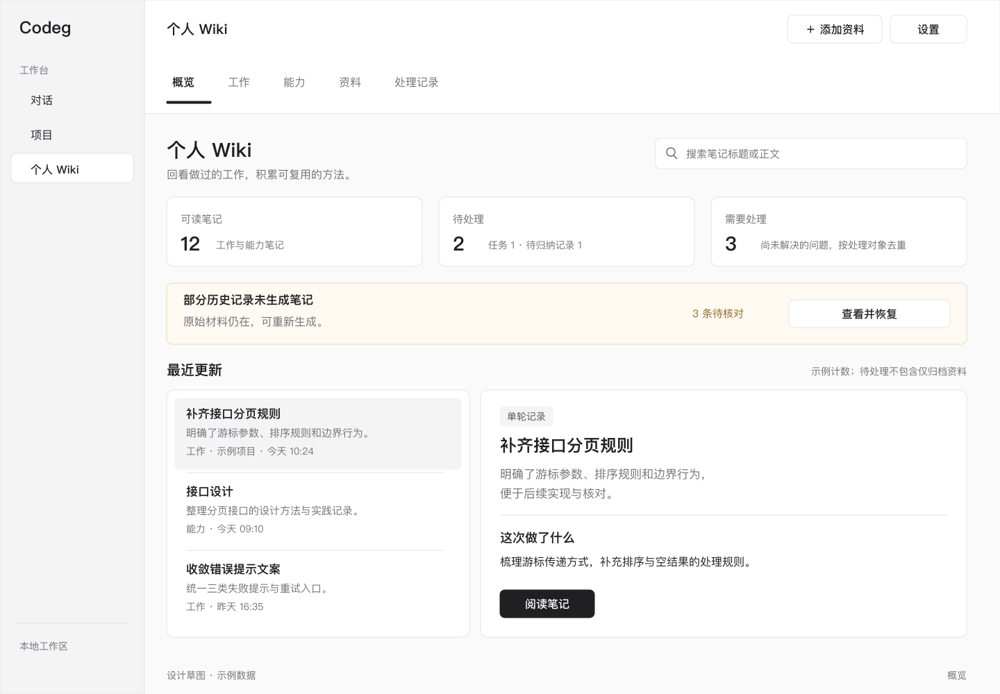
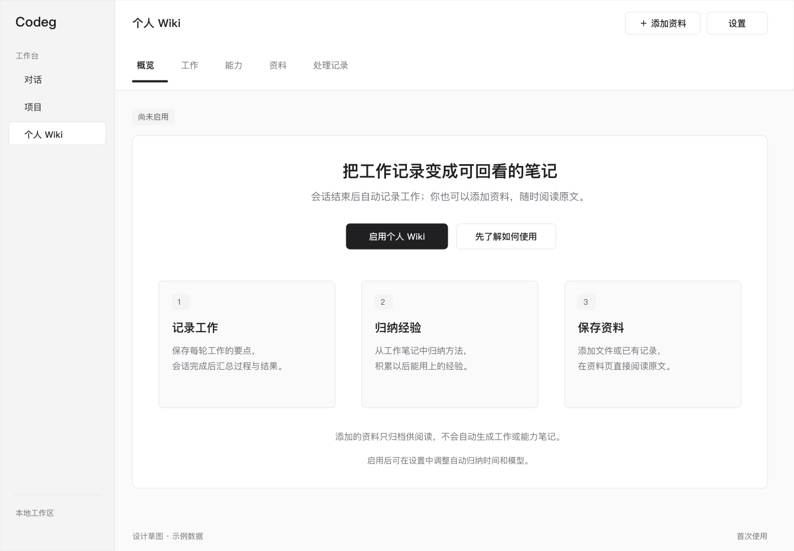
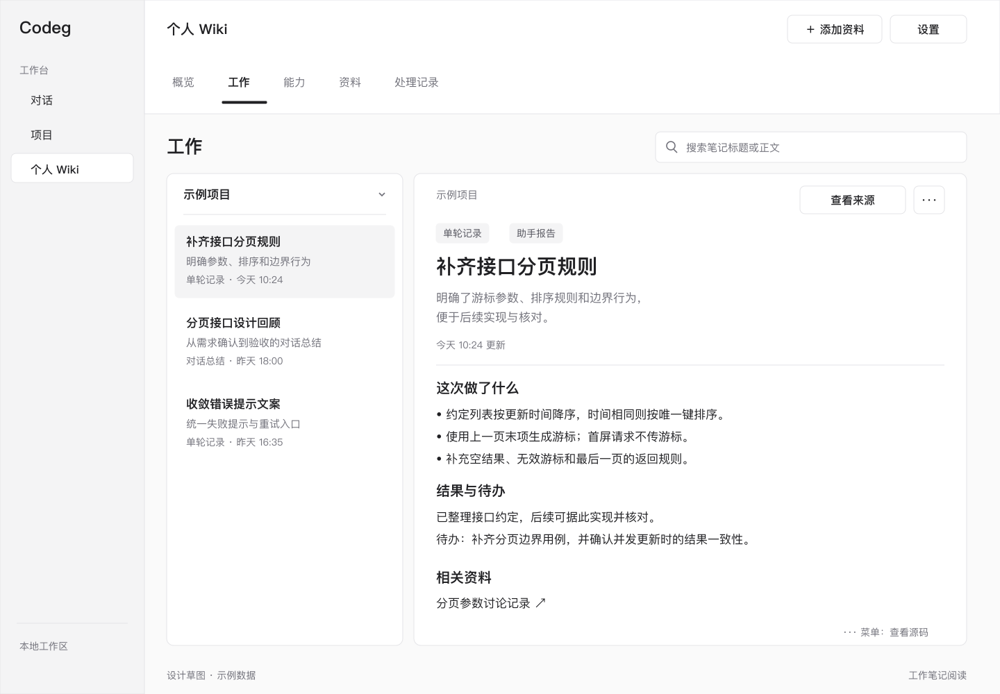
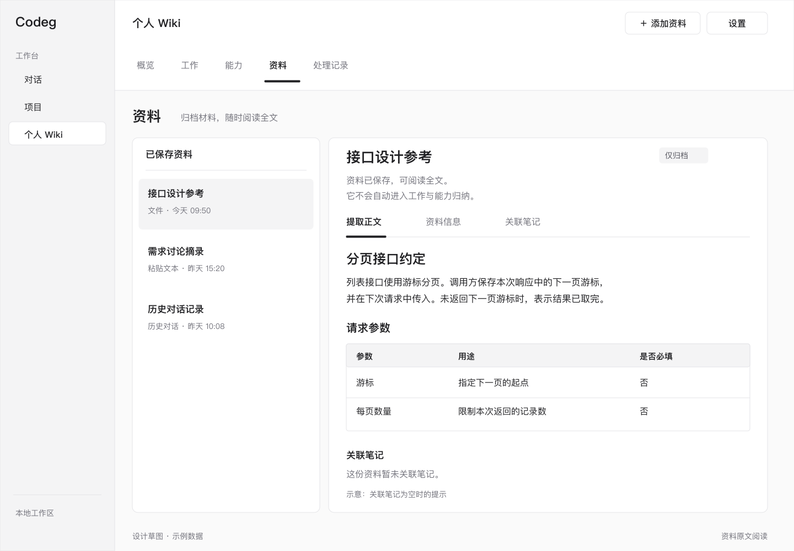
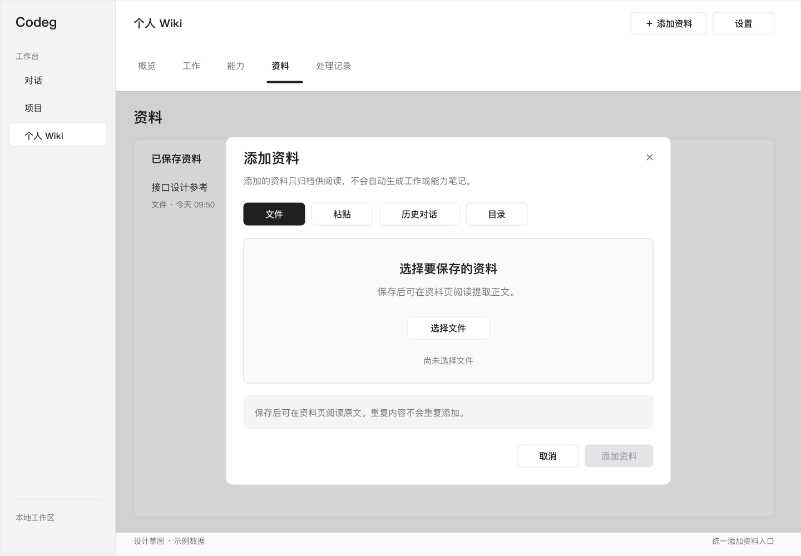
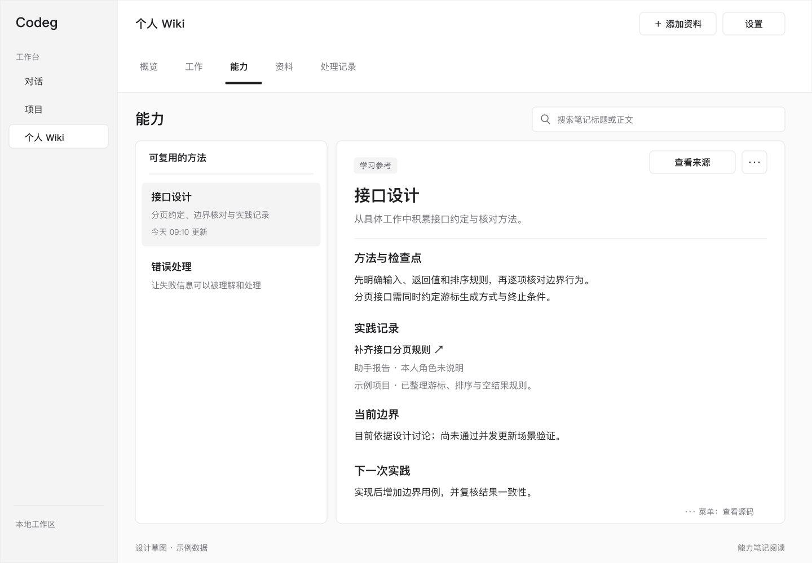
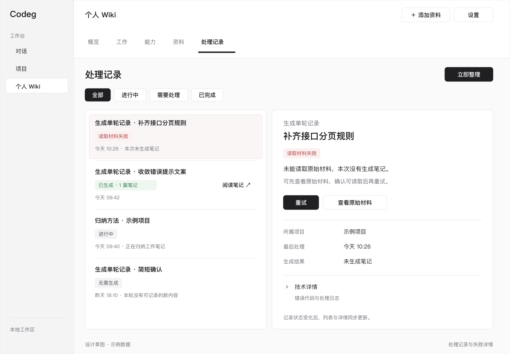
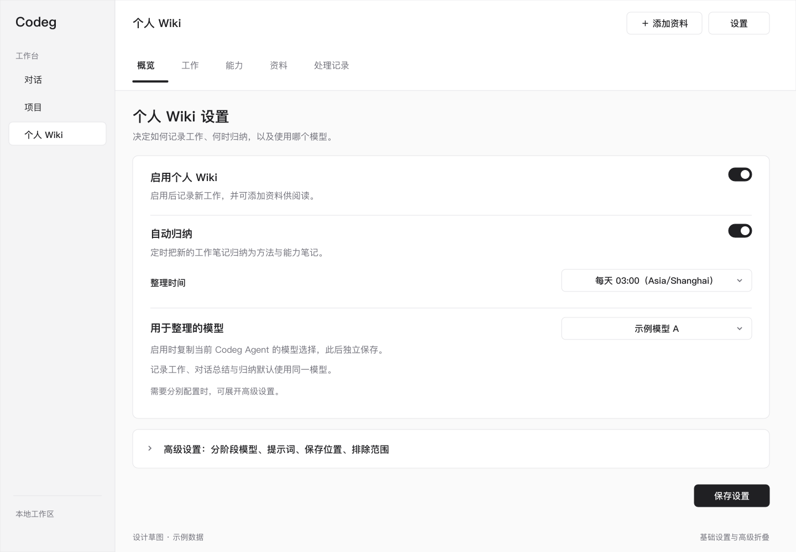

# 个人 Wiki 内容生成与阅读体验修复设计

| 项目 | 内容 |
| --- | --- |
| 日期 / 修订 | 2026-09-14 / v1.2 |
| 状态 | 已实施；v1.2 完成本机旧数据清理与新版配置准备 |
| 目标读者 | 产品、设计、前后端开发与测试 |
| 适用范围 | Codeg 桌面版与服务器版的个人 Wiki |
| 设计基线 | [记忆流水线方案](wiki-memory-pipeline-design.md)；2026-09-14 本地代码及实际 Wiki 检查 |
| 配套草图 | [离线草图导航](assets/personal-wiki-repair/index.html)，也可直接阅读本文内嵌图片 |
| 实施边界 | 本文定义修复目标，不代表现有界面、数据或能力已达成 |

## 当前存储要求：单一 Wiki（2026-09-14）

用户最新要求优先：正文统一放在 `wiki/`，状态在 `wiki-state/`，不再使用版本目录隔离数据；设置只读取 `wiki_settings`。已有数据直接迁入，保留原身份和关联，旧目录在用户验证通过后再删除。下文涉及放弃旧数据、版本隔离或重置的早期说明仅保留为历史决策记录，不再作为执行要求。当前代码已取消清空业务数据/配置及删除旧表的迁移动作，不新增复杂迁移框架。

## 后续要求：目录 Wiki 与轻量来源（2026-09-14）

用户后续明确：默认以目录 Wiki 阅读、可由 Obsidian 打开；代码补项目/文件夹/来源元数据；不做复杂输入冻结和信息验证，源文档存在性在使用时检查。[本轮实施说明](wiki-vault-navigation-metadata.md)优先于本文早期默认卡片布局、冻结输入和强制逐行证据要求。

## 0. 已确认的实施变更（2026-09-14）

用户在授权实施后补充：**旧的 Wiki 数据和相关配置直接抛弃，按照新的设计改动。** 本节优先于本稿早期兼容描述及旧草图。 之后进一步明确：本机旧数据现在清理，不保留备份；新包安装前就准备好可用的新配置。

- 不实现旧数据恢复、旧合同推断、旧设置转换或旧作业回填；草图 07 与历史恢复文案退出本期。
- 一次性数据库迁移清空 Wiki 专属来源、任务、贡献、绑定、消费和 vault 记录，删除旧 Wiki 配置；普通聊天、供应商配置及项目文件不属于重置范围。
- 默认文件和作业状态使用 `wiki-v2/` 与 `wiki-state-v2/`，不读取原 `wiki/`、`wiki-state/`。不通过递归删除用户配置过的任意目录实现数据重置。
- 新设置从默认值开始。第一次启用时可复制当前 Codeg 模型，此后独立保存；旧 ingest/compile 字段不再接受。 新版设置保存在 `wiki_settings_v2`，不回退旧 key。本机已按此合同创建开启状态的配置，三阶段绑定当前 Codeg 模型；旧运行实例不读取该配置。
- 新产生的数据仍遵守本稿的原文保护、人工内容保护、并发冲突、批次幂等和崩溃恢复合同。这里的“崩溃恢复”仅针对新版未完成的提交。
- G5、S3、A09/A10 改为验收新版本初始化及数据隔离，不再要求旧数据恢复；接口只提供新版查询/结果，过渡兼容不作为实施要求。

## 1. 要解决的问题与交付目标

个人 Wiki 应帮助用户回答三个问题：**做过什么、留下了什么可复用的经验、原始依据在哪里**。用户无需理解存储目录、任务类型或提示词，就应能启用功能、读到笔记、找到资料，并处理失败。

本次检查确认的基线是：64 份原始 ACP 材料仍在，64 个轮次总结任务全部显示成功但跳过正文写入，40 个来源阅读页全部只有元信息和“暂无贡献”。界面又直接展示 Markdown 源码，并把内部文件和空目录放在默认导航。数字仅描述检查时刻，不可写死为产品统计或恢复条件。

### 1.1 目标

| 编号 | 目标 | 可观察结果 |
| --- | --- | --- |
| G1 | 生成链路真实完成 | 有价值的原始材料能生成有正文、有标题、有出处的笔记 |
| G2 | 状态可信 | 读取失败不会显示成功；合法跳过说明理由；已生成状态带可打开的产物 |
| G3 | 直接阅读 | 正常排版正文，标题和摘要导航，原文一键可达 |
| G4 | 无需外部讲解 | 首次使用、添加资料、整理、查看结果与失败恢复各有明确下一步 |
| G5 | 新数据与旧库隔离 | 重置 Wiki 专属数据和配置，使用新版目录，不接入旧库；其他业务数据不变 |
| G6 | 后续维护可验收 | 页面、状态、接口、文案与测试场景能够一一对应 |

### 1.2 方案选择

| 路径 | 收益 | 不足 / 代价 | 结论 |
| --- | --- | --- | --- |
| 仅修工具与成功判定 | 能恢复部分生成链路 | 原文仍难读，用户仍无法判断下一步，归纳协议缺陷仍需处理 | 不作为完整交付 |
| 修生成闭环，建立阅读和状态入口 | 同时解决空内容、难阅读与难使用；可分阶段交付 | 需要统一读模型、结果合同和若干页面 | **采用** |
| 重建知识管理系统并加入自动导入归纳、问答、图谱 | 覆盖更多新场景 | 扩大已确定范围，无法优先验证本次缺陷 | 后续独立设计 |

### 1.3 保留与替换的产品规则

沿用既定三层流水线：ACP 成功一轮产生单轮记录；对话明确完成后产生对话总结；定时或手动将这些记录归纳为项目、方法和能力笔记。仅离开页面、长时间空闲不触发对话总结。导入文件、粘贴文本和历史会话仍只归档供阅读，本期不新增将它们自动或手动投入模型归纳的流程。

相对旧方案，本文替换以下细节：默认文件树入口、源码阅读、成功与跳过混用、未核验的提案消费、新页由模型补路径的隐含要求、旧数据与新合同混用、任务状态不及时刷新。其他已确定的采集范围、单 vault、证据角色、原件保护与项目绑定继续有效。

本期不增加图谱、向量检索、知识问答、笔记富文本编辑器、自动来源撤回、冲突合并编辑器、Obsidian 启动或新模型供应商。搜索采用现有本地文本与元信息。冲突仍保留待处理状态，本期只提供说明与查看，不新增覆盖合并操作。

## 2. 用户理解与内容组织

### 2.1 产品术语

| 用户看到的名称 | 含义 | 对应内部概念 |
| --- | --- | --- |
| 单轮记录 | 这一轮做了什么、结果如何 | turn-summary |
| 对话总结 | 一次已完成对话的整体回顾 | session-summary |
| 工作笔记 | 项目、职责、决策、工作记录和成果 | project / area / decision / work-record / outcome |
| 方法与概念 | 可复用的步骤、规则和适用边界 | method / concept；必要实体归入相关说明 |
| 能力笔记 | 围绕可复用工作任务整理的方法与实践依据 | capability |
| 资料 | 保存的原始会话材料、文件或粘贴文本 | wiki_source 及提取正文 |
| 处理记录 | 生成、归纳、恢复任务的进度与结果 | wiki_job |

正文、按钮和常规提示不使用 raw、vault、compile、ingest、frontmatter、UUID 或“消费输入”。这些术语仅出现在高级详情、源码和工程文档中。

### 2.2 页面结构

主导航保持五项：**概览、工作、能力、资料、处理记录**。“全部”改为“概览”，“任务”改为“处理记录”。右上保留“添加资料”和“设置”，更多菜单提供“浏览文件”。文件树成为高级工具，默认不出现维护文件；在该入口显式开启“显示内部文件”后才展示它们。

概览负责发现内容和下一步；工作按项目组织记录与工作笔记；能力展示可复用任务；资料负责原文；处理记录负责状态和恢复。所有笔记打开同一个阅读组件，避免各页面产生不同的阅读行为。

“方法与概念”可从概览的类型筛选直接进入结果列表，也可从工作/能力正文链接打开，不新增第六个主导航。

### 2.3 默认内容顺序

列表使用“标题 → 一至两行摘要 → 类型、所属项目、更新时间”。路径在详情菜单中查看。默认按更新时间降序，同时间按稳定标识排序；同名不同项目的笔记保持独立。

只有包含实质正文的笔记进入默认笔记列表和“可读笔记”统计。初始化 index、只有标题/元信息的占位文件、sources 登记页、日志、锁文件、规则文件均不计入。已有用户笔记只要有正文仍可阅读；缺少 note ID 时以规范化相对路径定位，不因元信息缺项消失。

默认显示用户选择的笔记；首次进入工作或能力列表，桌面宽屏选中第一条。空列表不展示伪造的示例内容。草图中的示例数据仅用于设计说明。

## 3. 界面草图与交互

图片使用目标文案与示例数据，不代表实际生成结果。SVG 源文件位于同目录，可继续修改；PNG 用于文档内嵌。草图强调信息、层级与操作，具体组件沿用当前 shadcn/ui 和主题变量。

### 3.1 概览：先看到可读内容与下一步



从上到下为搜索、状态提示、简洁统计、最近更新。状态提示按“需要修复配置/读取故障 → 正在处理 → 正常等待”显示，不用红条陈列已被后续成功替代的旧失败。

统计口径：

- **可读笔记**：去重后的实质笔记数，包含单轮记录与对话总结；不包含资料、索引和占位文件。
- **待处理**：queued/running 逻辑任务数，加上尚未被这些任务认领、等待归纳的新记忆输入数。界面明示“任务 {jobs} · 待归纳记录 {notes}”，不把单位混为一个“篇数”。只归档资料不计入。
- **需要处理**：未解决失败按逻辑工作项去重后的数量。该统计不是任务历史失败次数；重试成功后从这里移除。

点击统计进入带筛选的列表。最近更新卡片直接阅读；失败提示进入“处理记录”。没有新记忆时，“立即整理”给出“没有新的记录需要整理”，不调用模型。

### 3.2 首次使用与启用



首次无内容且未启用时，以一张说明卡解释“记录工作、归纳经验、保存资料”，主按钮“启用个人 Wiki”。点击进入同页配置面板：展示本次要使用的模型、每天归纳时间和资料用途，确认“启用”后才保存设置。

模型已配置时，只需确认启用。没有可用模型时，显示“先选择用于整理的模型”，按钮跳转模型设置，并保留返回 Wiki 的入口。只读检查模型是否存在且可选择，不后台发送付费探测请求。

启用后无笔记时改为“还没有工作笔记”，说明“完成一轮会话后，这里会出现工作记录。你也可以先添加资料，直接阅读原文。”按钮为“开始会话”“添加资料”；第一项复用现有会话创建流程。

已有内容但暂停 Wiki 时保留阅读界面，顶部显示“自动记录已暂停，已有内容仍可阅读”，操作为“恢复记录”。未启用、未采集、等待整理、执行失败、确实无需生成必须是不同状态。

### 3.3 工作列表与统一阅读器



左侧为项目筛选与笔记列表，类型筛选“全部记录、单轮记录、对话总结、项目与工作笔记”。右侧依次为标题、摘要、类型/更新时间/结果依据、正文、来源。列表标题可点击；上方卡片与搜索结果也使用同一打开动作。

正文宽度建议 680–840px，基础字号 16px、行高 1.7，标题、列表、引用、表格和代码块使用现有主题样式。表格/代码块在自身区域横向滚动，不能把整页撑宽。长文提供页内目录；没有足够标题时不显示。

默认“阅读”，更多菜单中提供“查看源码”“查看文件位置”。阅读器分离开头合法 YAML，不渲染 HTML 注释和 codeg-content 标记；保留所有用户正文区。未闭合或无效 YAML 不能粗暴删除一大段原文，降级显示可读文本并提示“部分格式未能识别”。

库内 wikilink、相对 Markdown 链接和标题锚点均可点击。代码块内的同样文本保持代码。链接不存在时显示“关联笔记暂不可用”，保留当前页，并提供“查看来源”；禁止跳到空白页面。默认按当前文件目录解析相对链接，wikilink 按库内路径解析，禁止越出已配置知识库。标准外链复用现有链接行为，不新增另一套权限弹窗。

### 3.4 资料：直接显示提取正文



资料列表显示人类可读标题、来源类型、保存时间和提取状态。详情分为“提取正文、资料信息、关联笔记”，默认第一项。提取正文从 source 对应的 raw_path 读取，不再先尝试 sources/UUID.md。来源登记页仍保留在文件浏览中，但不能替代正文。

资料上方明确“仅归档”，说明“资料已保存，可阅读全文。它不会自动进入工作与能力归纳。”ACP 自动采集资料则显示“会话材料”，其状态关联到对应单轮记录或对话总结，不错误标为“仅归档”。

资料信息展示来源名、导入时间、材料性质、本人角色、提取范围和警告；完整路径/哈希放“技术详情”。关联笔记查询真实贡献或已验证引用，空态为“这份资料暂未关联笔记”，不把“暂无”当正文。后续生成的关联关系从数据读取，不依赖重写旧 sources 文件。

提取不完整时仍可预览已有文本，提示“部分内容未能提取。请核对当前正文。”操作为“接受当前内容”“重新提取”。接受后文案为“已保存当前可读取的内容”，不承诺进入模型整理。重提取复用现有 API；记录当前提取版本，提取失败保留上次可读版本。

### 3.5 添加资料：统一入口与明确结果



统一入口提供文件、粘贴文本、历史对话和目录。文件支持既有 MD、TXT、文本型 PDF、DOCX；扫描件无可提取文本时给明确原因。桌面目录使用已有选择器；服务器模式明确“服务器上的目录”，不把用户电脑路径传成服务器路径。当前运行环境不支持的方式不显示为可用。

必填只有文件/文本/选择对象。标题可选，自动建议；材料性质默认“参考资料”；作者、本人角色、所属项目等收进“补充信息”。不要求用户理解项目 ID、source ID 或证据字段。

底部固定说明“添加的资料只归档供阅读，不会自动生成工作或能力笔记”。添加完成显示持久结果：“已添加 {n} 份资料”“{n} 份内容已存在”“{n} 份需要处理”，每条有“阅读资料”或具体错误；主按钮“查看资料”。关闭弹窗也必须让当前资料列表刷新，不只显示一条 toast。

### 3.6 能力笔记：方法、依据和边界



能力列表以可复用的工作任务命名，卡片显示用途和证据概况。正文包含“适用场景、方法与检查点、实践记录、当前边界、下一次实践”。与工作阅读器共用来源、链接和源码入口。

证据标签统一为“学习参考”“已有实践记录”“已有结果依据”；它们分别表达资料依据、本人参与记录和可核对结果，不代表能力等级。没有本人角色时，只记录助手或团队做过的事。禁止用会话次数、导入数量或模型信心生成熟练度分数。

没有可支持能力笔记的材料时显示“还没有能力笔记”，说明“工作记录积累后，整理会提炼可复用的方法和实践依据。”提供“查看工作记录”；有待归纳输入时才增加“立即整理”。不补空能力页凑目录。

### 3.7 处理记录：知道发生了什么，能到达结果



筛选为“全部、进行中、需要处理、已完成”；已完成再提供“已生成、无需生成、无新记录、已取消”。每条以“动作 + 来源/主题标题”命名；UUID 仅在技术详情中显示。最新逻辑任务优先，历史尝试折叠。

详情展示处理对象、当前阶段、开始/结束时间、结果数量、可点击产物、跳过原因、可执行下一步。已生成时显示“已生成 · {n} 篇笔记”；读取失败时显示“读取材料失败”，说明“未能读取原始材料，本次没有生成笔记。”。出现配置问题时按钮为“检查模型设置”，不能对所有错误一律提供重试。

“立即整理”只触发工作归纳。单轮记录处理失败时引导到“处理记录”重试对应任务，不能让用户反复点击归纳来修复上游摘要。没有选中任务时，按钮调用失败也应在按钮附近显示错误。

### 3.8 新版本初始化

按 §0 和 §7 重置 Wiki 专属旧数据与配置，以全新库进入首次使用流程。不提供旧任务恢复页面；原草图 07 留作历史设计资料，不属于当前实施目标。新版失败任务通过“处理记录”重试。

### 3.9 设置：常用项短，高级项收起



基础区域为“启用个人 Wiki”“自动归纳”“整理时间”“用于整理的模型”。默认按已配置时区每天 03:00，显示完整本地时间说明与下一次运行。常规时间选择器生成现有 cron；已有自定义 cron 时显示“自定义日程”，进入高级项修改，不擅自转成每日。

初次启用时将当前 Codeg Agent 的 provider_id + model_id 复制到三个阶段，此后由 Wiki 独立保存。已有 Wiki 选择必须保留；更改普通聊天模型不联动 Wiki。三个阶段相同时显示统一模型，分开时显示“已分别设置模型”；“统一使用此模型”是显式动作，不在打开页面时覆盖。已保存的供应商或模型被删除时显示配置不可用，禁止静默换到当前聊天模型。

高级区域折叠“分阶段模型、提示词、保存位置、时区、采集排除范围、浏览文件”。提示词编辑保留恢复默认；宿主输出合同固定附加，用户提示词不能改变路径、身份与验证要求。保存按钮位于固定底部，失败信息在表单顶部和对应字段显示。

“自动归纳”仅控制定时入队；关闭后仍可使用“立即整理”。

关闭 Wiki 停止领取新任务，已有内容仍可阅读；运行中任务完成当前不可中断的提交后停止后续模型/批次，排队任务保留。恢复开关继续处理，不自动重做成功任务。切换保存位置前要求当前 vault 没有 running/committing 作业，界面给出“请等待当前处理完成后再切换”，不静默搬迁现有资料。

### 3.10 窄屏、搜索与来源面板

宽度大于等于 1024px 使用列表/阅读双栏，列表建议 280–340px；768–1023px 允许列表收起为抽屉，阅读优先；小于 768px 使用“列表 → 正文”两屏，正文顶部固定“返回列表”，返回时保留筛选和列表滚动位置。顶部主导航可横向滚动，操作按钮折叠进更多菜单；只允许表格和代码区域内部横向滚动。

搜索输入停顿 300ms 后查询，按 Enter 立即查询；取消旧请求或用请求序号忽略迟到响应。搜索结果显示命中片段和所属项目，结果卡直接进入对应笔记/资料。无结果与请求失败分开显示，清空搜索恢复原列表。

“查看来源”宽屏在右侧面板打开，窄屏作为可返回的全屏层。每条来源显示材料标题、引用段落和“阅读原始材料”；原文按定位滚动并高亮。没有行号但有有效source_id的历史引用，打开原文顶部并提示“此记录未保留具体段落”。所有弹层关闭后焦点返回触发按钮。

## 4. 可读内容合同

### 4.1 一篇合格笔记应包含什么

| 类型 | 必须回答 | 可省略条件 |
| --- | --- | --- |
| 单轮记录 | 做了什么；主要结论；结果及仍需确认的事项；依据 | 没有改文件时不必罗列空清单，正文明确“本轮没有记录到文件修改” |
| 对话总结 | 目标；关键过程与选择；完成结果；未完成项；对应记录 | 不重复粘贴每轮全文，引用具体记录 |
| 工作笔记 | 问题与背景；行动/决定；结果；本人角色与来源 | 未知角色写“未说明”，结果只到证据支持程度 |
| 方法与概念 | 解决什么；何时适用；步骤/规则；限制；可追溯依据 | 无实践依据可以只形成方法说明 |
| 能力笔记 | 适用场景；方法；实践；边界；下一次实践 | 实践缺失保留“尚无本人实践记录”，不得虚构补全 |

所有类型必须有可读标题、非空实质正文和至少一个可解析来源定位。摘要通常一至两句，表达内容结论而非“本资料关于……”。语言跟随来源；界面标签跟随应用语言。既有标题不满足规范时按新生成规则更新标题，不更改稳定文件身份。

正文先讲有依据的结论，再提供过程与细节。小内容可以很短，不设强制字数门槛；只有 YAML、标题、链接清单或“暂无”的生成提案不能作为内容笔记提交。主机负责结构与引用存在性，语义是否正确通过代表性样本评估，不能声称靠字数和 schema 已验证知识真实性。

### 4.2 示例：目标表达方式

以下为设计示例，不是对现有项目事实的陈述：

> **补齐接口分页规则**  
> 明确了游标参数、排序规则和边界行为，便于后续实现与核对。  
> **这次做了什么**：整理了下一页游标的返回条件，记录了数据更新时保持排序稳定的要求。  
> **结果与待办**：助手报告已补充规则；仍需核对空页和重复数据场景。  
> **依据**：来自本次会话记录，可打开原始材料查看。

阅读页将“助手报告”“用户确认”“有可核对产物”作为不同依据，不把工具执行成功等同于功能已验收，也不等同于用户具备该能力。

### 4.3 合法不生成

只允许在宿主确认输入已成功读取后，以枚举说明空白/全部脱敏/无新增持久信息等原因。原文读取失败、工具身份拒绝、模型返回无效格式、超时、关键输入未覆盖均是失败或未完成，不可映射为“无需生成”。

正常跳过不创建占位笔记，不污染默认列表；处理记录保存原因与输入定位。来源正文仍可阅读。

## 5. 状态与结果合同

### 5.1 执行状态与产出结果分离

保留数据库现有 status：queued、running、succeeded、failed、cancelled。增加版本化结果对象，存入现有 output_manifest，并以结构化字段暴露给 API。旧结果缺字段时是“历史结果未核验”，不能默认归为已生成。

| status | result.outcome | 用户文案 | 必须满足 |
| --- | --- | --- | --- |
| queued | 空 | 等待处理 | 已持久入队 |
| running | 空 | 正在读取 / 正在生成 / 正在保存 | 阶段由宿主实际步骤更新 |
| succeeded | generated | 已生成 · {n} 篇笔记 | n > 0，提交清单持久化且产物已校验 |
| succeeded | no_content | 无需生成 | 读取覆盖通过，原因属于合法跳过 |
| succeeded | no_new_input | 没有新记录 | 宿主确认待归纳清单为空；不调用模型 |
| failed | 空 | 具体错误标题 | 无已提交产物；保留原材料 |
| failed | partial | 部分完成，需要继续处理 | 前面批次已提交，剩余输入未被消费 |
| cancelled | 空或 partial | 已取消 / 已停止，部分笔记已保存 | 只保留已确认提交的产物 |
| 历史终态 | unknown | 历史结果未核验 | 缺少新合同或无法核对产物 |

result 最小字段：version（固定 1）、outcome、reason_code、outputs、processed_inputs、remaining_inputs、warnings。outputs 每条包含 note_id、path、title、type、content_hash；没有生成时 outputs 必须为空。processed_inputs 每条包含输入路径/哈希、disposition（used 或 no_content）、source_ids。remaining_inputs 只能来自已冻结 manifest。output_manifest 是结果的唯一持久化来源，不再增加一份内容重复的 outcome_json 列。

旧数据不回写成新成功；API 可给出归一化历史视图。历史已生成结果不因文件后来被删除而改成失败，读取详情另外返回 output.availability（available、missing、conflict）。异常说明、输出对象和警告分开，界面禁止从 error_message 或模型 warning 自行推断状态。

### 5.2 稳定错误分类

| reason_code | 标题 | 恢复动作 |
| --- | --- | --- |
| tool_identity_missing | 暂时无法读取材料 | 修复版本安装后重试；技术详情留内部原因 |
| source_read_failed | 读取材料失败 | 查看原始材料；问题解决后重试 |
| source_missing | 原始材料不存在 | 查看资料信息；不自动补写 |
| input_changed | 材料已变化 | 重新读取当前版本后重试 |
| model_unavailable | 整理模型不可用 | 检查模型设置 |
| invalid_output | 本次未生成有效笔记 | 重试；连续失败时检查提示词 |
| incomplete_input | 部分材料尚未处理 | 继续处理剩余材料 |
| write_conflict | 笔记有更新，需要核对 | 查看现有笔记与技术详情；禁止覆盖 |
| deadline_exceeded | 处理超时 | 重试未完成部分 |
| no_durable_content | 没有需要保留的新内容 | 查看原始材料；无错误色 |

错误码由宿主产生。正常生成可以附“未记录文件修改”等非阻断 warning，但读取失败 warning 必须影响终态。不从旧任务字段推断新版生产结果。

## 6. 生成链路修复设计

### 6.1 统一 Wiki 执行上下文

每个 job attempt 创建一个共享运行上下文，包含 identity bridge、ContextStore/FactRecorder、CancellationToken、当前 job/attempt 标识及受控文件系统。NativeToolCtx 和 CodegHook 引用同一份身份与取消令牌；Hook 在每次调用前登记真实 tool_call_id、函数名和 turn_id，工具才开始读文件。不得通过取消身份校验或放宽文件权限来修复。当前身份桥是单槽，本期 Wiki 工具调用保持串行，同一响应的多个工具调用也必须逐个执行。

保留 AutoAllow 与现有 Wiki 读写范围，无交互权限卡；AutoAllow 仅表示该范围内无需用户逐条批准，不免除身份、范围和取消校验。为该入口增加可传入共享上下文的构造方式，普通会话继续使用原有路径。

工具结果增加宿主执行凭据：调用 ID、工具名、规范化相对路径、实际读取范围、读取版本哈希、成功/失败、是否读到末尾。identity 失败可能发生在 FactRecorder.started 之前，因此 Hook 的真实工具结果必须作为补充记录，不能只依赖已开始的 ExecutionFact。不保存密钥或无关目录内容。

FactRecorder、Hook 和工具 recall 的长输出保存目录必须统一为当前 job/attempt 的 staging/spills，禁止一端写临时全局目录、一端从另一个目录读取。上下文身份使用 job/attempt，不能全部叫固定 wiki-worker。WikiLlm 返回值改为宿主类型 WikiLlmRun，分别包含模型 output 与宿主 evidence；Mock 必须显式构造证据，模型不能在 JSON 中自报成功读取。

### 6.2 必需输入的读取证明

单轮记录必须完整覆盖该 raw 的可读取文本；对话总结先完整读取本轮列出的摘要，必要时完整读取被选作依据的对应原文；无摘要的本地会话必须覆盖宿主导出的正文。归纳只消费已读完且有处理结果的输入。

按字节/行范围合并多次 read 记录，判断覆盖时必须绑定同一内容哈希，并以实际交付给模型的文本范围为准。工具已读到但被 Hook 截断、存入 spills 且未 recall 的部分，不算模型已获得。grep/glob 的命中不能算读完一份输入。可选项目目录读取失败只影响依赖该目录的声明；没有使用它的提案不因未读项目目录失败。

同一调用最后成功重读并覆盖完整文件，可以消除之前的暂时读取失败；始终没有成功读取的必需输入不能被模型的“无需生成”覆盖。流终止错误后，即使留下看似完整 JSON，也必须按未完成处理，不能拼接中间解释文本作为终态。

### 6.3 输出合同 v2：宿主分配身份与路径

三个任务均使用版本化结构化 JSON，宿主统一套 YAML 与生成区标记。turn/session 的稳定路径保持现有约定。归纳提案也改为“元信息 + 正文 + 引用”，模型不生成系统 note ID、源 ID、文件路径、before_hash 或生成区标记。

归纳输出示例（字段属于拟实施合同）：

```json
{
  "schema": "codeg.wiki.synthesize.v2",
  "processed_inputs": [
    {
      "rel": "work/turns/source-example.md",
      "content_hash": "host-provided-hash",
      "disposition": "used"
    }
  ],
  "page_proposals": [
    {
      "proposal_key": "pagination-method",
      "op": "create",
      "type": "method",
      "existing_note_id": null,
      "title": "游标分页的边界检查",
      "summary": "整理空页、重复数据与稳定排序的检查方法。",
      "body": "## 适用场景\n检查连续翻页的边界行为。\n\n## 检查步骤\n逐项核对空页和重复数据。参见[来源 1]。",
      "evidence": [
        {
          "ref": "来源 1",
          "input_rel": "work/turns/source-example.md",
          "start_line": 8,
          "end_line": 14
        }
      ],
      "input_rels": ["work/turns/source-example.md"]
    }
  ],
  "warnings": []
}
```

宿主校验 schema、字段、类型、proposal_key 唯一性、证据定位与实际读取覆盖。used 输入必须被至少一条提案引用；no_content 必须有允许的 reason_code。processed_inputs 必须恰好覆盖本批 manifest，不能有遗漏、重复、伪造哈希。提案全部被丢弃、空对象、used 没有提案均为 invalid_output。

| 提案字段 | 约束 |
| --- | --- |
| op | create、update、supersede 三种之一；不支持删除 |
| type | 现有可提交领域类型白名单；不能从归纳任务产生turn/session或index |
| existing_note_id | create必须为空；update/supersede必须来自冻结索引 |
| title / summary / body | title与实质body必填；summary允许宿主取首段；body不含系统YAML |
| proposal_key | 当前批唯一、用于宿主分配与同批关联，不作为跨作业知识身份 |
| input_rels / evidence | 只引用本批已读输入；证据至少一条，行范围在对应冻结版本内 |
| related_proposal_keys | 可选，只引用当前批其他有效提案；宿主分配后转链接 |
| replacement_note_id / replacement_proposal_key | 仅supersede使用，二选一且目标有效；旧页保留正文并标记替代关系 |

所有输入都属于合法no_content时允许空page_proposals；除此之外空提案集合均不算成功。不再保留由模型随意设置的nothing_to_persist开关作为宿主绕过校验的入口。

create 时宿主生成 UUID 与稳定路径：类型对应目录下采用“首次标题 slug + 短 ID”，路径/ID 写入暂存提交清单后固定；同一暂存提案的重试或崩溃恢复复用清单，标题变化不改路径。全新模型尝试若尚无已提交或暂存提案，不要求模型复现上次 proposal_key。新页正文中的证据占位引用由宿主替换为可点击定位；未声明或不存在的引用拒绝。同批新页之间通过结构化 related_proposal_keys 引用，宿主分配路径后统一解析，不让模型猜路径。

已有条目更新必须以 existing_note_id 匹配冻结索引，宿主在请求前冻结原路径和 before_hash。提交比较这份冻结哈希，不在模型返回后读取当前文件充当 before_hash；否则会掩盖模型调用期间的用户修改。无法唯一定位同一 note ID 时明确 write_conflict。不得仅按标题合并。

宿主生成元信息中的来源、项目绑定、本人角色与核验标记；模型正文声称超出证据时不能靠改 YAML 认为已经修正，需退回该批生成或标失败。实践证据不足可以生成方法知识，但不能升级为本人实践。

现有自定义提示词保留，固定 v2 合同与宿主约束附加在其后。升级后持续输出旧格式时明确 invalid_output，提示“提示词需要更新”，提供查看默认说明；不得静默抹掉用户提示词或无限重试旧格式。旧合同消费键与 v2 隔离，但不因此自动全库重跑；升级扫描按 §7 建立待处理集合。

### 6.4 分批、提交与消费

归纳按稳定排序冻结尚未处理的记忆输入。每批最多 8 篇、合计正文最多 60,000 Unicode 字符；还要使用已有上下文预算器估算，扣除提示词、工具 schema 和输出预留后，输入不得超过可用窗口的 60%。实际批大小取三项限制的最小值。这两个篇数/字符阈值是本方案初始工程参数，不在界面暴露为使用门槛。

单篇超出批预算时独占一批，不截断。必须读取的文件过长时，宿主按完整行切成最多 12,000 字符的片段（超长单行按 Unicode 边界拆分并记录范围）；每段生成带原文定位的事实摘要，保存在本 attempt staging。中间摘要只作为当前作业输入，不发布成知识笔记、不登记整篇消费。所有段都成功且范围无缺口后，用完整段摘要清单生成最终提案；归并发现依据不足时可回读原段。任一段失败，整篇保持未完成。复用已有读取/预算模块实现，不恢复旧候选配额流水线。

既有单页硬上限继续负责阻止异常全文倾倒；超限明确失败，保留输入。全部覆盖证明也不等于模型理解全部内容，仍需按 §11 的真实样本核验语义。

同批提案在写入前全部完成路径、结构、证据与冲突检查。任何一项无效时本批不提交、不消费；此前成功批次保留。不同批次不并发写同一 vault，下一批使用前一批已提交索引，避免覆盖。

v2 消费写入新增 wiki_memory_consumption 表，字段为 id、vault_id、input_kind、input_ref、content_hash、contract_version、job_id、batch_id、disposition、created_at。唯一键为 vault_id + input_kind + input_ref + content_hash + contract_version；本期 input_kind 固定 memory_note，input_ref 是库内相对路径，content_hash 固定为该输入完整文件字节的哈希。

删除旧 wiki_compile_input 与 wiki_source_segment 表。新版消费表只服务新数据，不填充伪来源 ID 或推断旧消费状态。部署 v2 后，只将实际可读、尚无 v2 消费登记的记忆页列为待归纳，按用户启用的正常日程或手动操作处理；不会由数据库迁移触发模型调用。

来源是否已有笔记另查贡献关系。界面待处理统计从逻辑任务与未认领记忆输入计算。未来同一进程切换 vault 时，相同相对路径与哈希也不能串用消费状态。

文件提交与 SQLite 不能假装是一个事务。使用持久提交清单记录 job、batch、输入哈希、每页身份、before/after hash 和 applied 状态。先基于冻结 before 内容合并人工区，算出最终落盘字节，再计算 after_hash 并持久清单；不能使用合并人工区之前的提案哈希。

文件完成后在一个 DB 事务中登记幂等贡献、消费、产出结果和该批终态，再标记清单 finalized 并发事件。新增 wiki_job_batch 记录 job_id、attempt、batch_id、manifest_path、manifest_hash、result_json、finalized_at，唯一键为 job_id + attempt + batch_id。同事务先取得该批唯一登记资格，再写贡献/消费/结果；已登记同一 manifest_hash 的批次只返回现有结果，哈希不同则冲突。这样重复 finalize 不会重复插入贡献，不必清理旧贡献记录。

DB finalize 失败只重试登记，不能忽略错误后显示成功。启动恢复核对清单与文件哈希，补齐已落盘批次的 DB 登记；不能再次调用模型或分配新 ID。current==after 说明该文件已应用，current==before 才允许继续，其他值转 write_conflict。已 finalized 的历史清单不能用于复活用户后来删除的文件。索引/日记为可重建衍生物，其更新失败不能触发正文再次生成。

取消令牌传入模型/工具；每个模型尝试有独立截止时间（沿用 30 分钟总预算），取消或超时后禁止开始新提交。已经进入受保护的文件提交阶段应完成或恢复当前清单，然后停止。瞬时连接错误总计最多 3 次尝试，间隔 1 分钟、5 分钟，next_attempt_at 必须持久化；认证、schema、身份接线错误和写冲突不自动重试。旧注释的“1/5/15 分钟但最多 3 次”口径在本次统一。

## 7. 新版本初始化与数据隔离

### 7.1 一次性升级

迁移只操作 Wiki 专属表，按依赖顺序清空旧记录，移除旧消费表，建立新版消费与提交账本。清空 `wiki_settings` 与 `wiki_db_instance_id`；迁移不调用模型。应用关闭旧回填逻辑，不从已有 Completed 对话自动重建被丢弃的 Wiki 数据。

### 7.2 存储与设置

新默认目录为 `wiki-v2` 与 `wiki-state-v2`。旧文件不加入新版索引，旧自定义保存位置不自动继承。手动选择位置时须符合当前 Wiki 格式，不能通过设置切换隐式加载旧库。首次启用提供模型选择；保存后不得再用普通聊天设置补写空槽或替代失效模型。

### 7.3 新数据生命周期

新逻辑作业使用数据库唯一约束保证幂等；重试保存尝试历史与持久退避时间。提交清单只恢复未 finalized 的批次，不能复活用户删除的已完成笔记。重置迁移不可逆，应用回退不承诺还原被丢弃数据。

## 8. 读取模型与接口设计

以下均为拟新增或扩展的合同，不表示当前已有。所有接口通过现有 getTransport().call 调用；Tauri 命令与 Web handler 复用 _core，服务器沿用现有命令路由形式，不另建不兼容 REST 体系。

### 8.1 统一笔记读模型

宿主解析 Markdown 得到 WikiNoteSummary：note_id（可空）、path、type、title、summary、updated_at、project_ids、source_ids、has_content、content_hash。旧用户笔记没有 note ID 时仍按 path 返回；排序、分页和链接不可依赖数组下标。

WikiNoteDetail 在列表字段上增加 body_markdown、metadata、references、format_warnings。读取完整正文时包含所有人工区，只移除已识别的 YAML 与生成控制标记。源码通过现有受控 wiki_vault_read 获取。资料正文返回独立 WikiSourceDocument，来源身份不冒充知识笔记。

标题优先 frontmatter.title，其次第一个 Markdown 一级标题，再次原文件名；sources UUID 文件不进入默认笔记列表。摘要优先可读 summary，其次正文首段，禁止把 YAML 字段/内部注释作为摘要。

搜索默认只查可读笔记标题与正文，单独“资料”范围可查资料标题和提取正文；不跨目录搜索隐藏规则、日志或凭据。空查询返回最近更新。使用大小写归一化与 Unicode 文本匹配，标题命中优先，再按更新时间；中文按输入短语匹配，不依赖外部服务。分页默认 30、上限 100；结果带可读片段与高亮范围。

首次列表/搜索可扫描宿主管理目录建立内存索引；按 vault/config revision 隔离缓存。宿主提交事件按变更路径更新缓存；手动刷新重扫，支持用户用外部编辑器修改文件。前端不下载全库正文进行筛选；不新增向量数据库。

### 8.2 命令清单

| 命令 | 请求重点 | 返回 / 约束 |
| --- | --- | --- |
| wiki_get_overview | 当前 vault；无客户端任意绝对路径 | enabled、model_state、counts、next_run_at、recent_notes、actionable_issues、revision |
| wiki_list_notes | view/type/project_id/query/scope/offset/limit | items、total、has_more、revision；统一过滤占位文件 |
| wiki_read_note | path 或 note_id | WikiNoteDetail；映射当前库内有效路径 |
| wiki_read_source_document | source_id | 正文、提取状态、版本、warnings、linked_notes；不优先 sources 包装页 |
| wiki_list_jobs_page | status_group/outcome/query/offset/limit | items、total、has_more；保留旧 wiki_list_jobs |
| wiki_list_sources_page | source_kind/query/offset/limit | items、total、has_more；保留旧 wiki_list_sources |
| wiki_preview_recovery | 当前 vault + 可选筛选 | preview_id、expires_at、候选分类、条件指纹；只读 |
| wiki_start_recovery | preview_id、request_id、selected_ids | batch_id、created/reused/skipped 条目；重新核验 |
| wiki_get_recovery | batch_id | 已选择项、进度、逐项结果、产物链接 |
| wiki_compile_now | 既有 request_id | 保留名称；返回结构化 job，空输入明确 no_new_input |
| wiki_retry_job / wiki_cancel_job | 既有 job id | 保留名称，按新结果与提交阶段执行并返回明确状态 |

涉及状态组过滤的分页必须在服务端先过滤、再 count 和分页。旧数组归一化不能用 items.length 假装 total。预览资料正文与列表均遵守既有受控路径读取规则；分页错误显示错误，不回退为空成功。

### 8.3 事件与导航

扩展现有 wiki://job-changed，兼容保留 id/status/version，增加 vault_id、revision、kind、phase、outcome、changed_note_paths、changed_source_ids、batch_id。事件在持久状态更新后发送。导入、接受提取、重提取和标注变更还需统一 wiki://content-changed，携带同样的 vault/revision 与路径范围。

前端一个 Wiki 数据层统一订阅并刷新概览、任务列表/详情、资料列表与当前正文；相同 revision 合并，过期响应不覆盖新状态。取消订阅必须成对清理。当前阅读内容更新时保持滚动位置并提示“内容已更新”；当前文件被删除则显示状态，不继续展示旧正文冒充最新。

手动“刷新”同时刷新列表和选中详情；传输重连后重取当前页。事件连接不可用且页面有进行中任务时，每 5 秒补查当前可见数据，页面隐藏时暂停；终态后停止轮询。

静态导出不增加动态路由。复用工作台 Wiki route，并使用查询参数 wikiView、wikiPath、wikiSource、wikiJob、wikiQuery、wikiScope；每次主动打开新笔记使用 pushState，筛选输入使用 replaceState，订阅 popstate 恢复前后跳转。非法参数忽略并回到相应列表，不导致空白。跨 view 打开链接需同步切换导航。

## 9. 文案设计

### 9.1 文案原则

每条异常信息回答“发生了什么、影响是什么、现在能做什么”。主提示不出现堆栈、UUID、schema 名称或原始内部英文错误；技术详情可展开原码。数量必须使用动态变量和本地化复数；时间按设置时区，必要时显示时区名称。

下表为简体中文基准。新 key 均以 Wiki.v2 开头，沿用 next-intl，为现有 10 种语言补齐；英文为语义基准翻译，禁止在其他语言暂填中文。旧 key 可短期保留兼容，但不得在同一路径同时展示相互矛盾的说明。

### 9.2 导航、概览与首次使用

| key（Wiki.v2. 前缀省略） | 文案 | 使用条件 / 动作 |
| --- | --- | --- |
| nav.overview | 概览 | 替代“全部” |
| nav.processing | 处理记录 | 替代“任务” |
| overview.description | 回看做过的工作，积累可复用的方法。 | 常规副标题 |
| search.placeholder | 搜索笔记标题或正文 | 默认笔记范围 |
| search.sourcePlaceholder | 搜索资料标题或正文 | 资料范围 |
| search.empty | 没有找到相关内容 | 次说明“试试更短的关键词，或切换搜索范围。” |
| overview.recent | 最近更新 | 列表标题 |
| overview.readable | 可读笔记 | 排除资料与占位 |
| overview.pending | 待处理 | 带任务/记录单位细分 |
| overview.pendingDetail | 任务 {jobs} · 待归纳记录 {notes} | 不含只归档资料 |
| overview.attention | 需要处理 | 未解决问题按逻辑项去重 |
| onboarding.title | 把工作记录变成可回看的笔记 | 未启用且无内容 |
| onboarding.description | 会话结束后自动记录工作；你也可以添加资料，随时阅读原文。 | 解释两条用途 |
| onboarding.enable | 启用个人 Wiki | 打开启用确认面板 |
| onboarding.learn | 先了解如何使用 | 展开同页三步说明 |
| onboarding.stepRecord | 记录工作 | “成功完成一轮会话后，自动记录这次做了什么。” |
| onboarding.stepSynthesize | 归纳经验 | “按设定时间整理记录，形成工作和能力笔记。” |
| onboarding.stepArchive | 保存资料 | “添加文件或文本，随时阅读和查找原文。” |
| onboarding.enabled | 个人 Wiki 已启用 | 提示从一轮工作开始 |
| empty.work.title | 还没有工作笔记 | 确认列表无正文且没有运行/失败状态 |
| empty.work.description | 完成一轮会话后，这里会出现工作记录。你也可以先添加资料，直接阅读原文。 | 按钮“开始会话”“添加资料” |
| empty.pending.title | 工作记录正在生成 | 有活跃上游任务 |
| empty.pending.description | 原始材料已保存，处理完成后会自动显示。 | “查看处理进度” |
| empty.capability.title | 还没有能力笔记 | 不造空页 |
| empty.capability.description | 工作记录积累后，整理会提炼可复用的方法和实践依据。 | “查看工作记录” |
| paused.description | 自动记录已暂停，已有内容仍可阅读。 | “恢复记录” |

### 9.3 阅读与添加资料

| key | 文案 | 使用条件 / 动作 |
| --- | --- | --- |
| reader.sources | 查看来源 | 打开来源面板 |
| reader.sourceCode | 查看源码 | 高级入口 |
| reader.fileLocation | 查看文件位置 | 显示库内路径，不承诺系统打开 |
| reader.updated | 内容已更新 | 保持阅读位置 |
| reader.missing | 这篇笔记暂不可用 | 次说明“文件可能已移动或删除。”；“返回列表” |
| reader.linkMissing | 关联笔记暂不可用 | 保留当前正文 |
| reader.formatWarning | 部分格式未能识别 | “查看源码” |
| source.body | 提取正文 | 默认标签 |
| source.info | 资料信息 | 来源/角色/范围 |
| source.related | 关联笔记 | 查询真实关联 |
| source.archiveOnly | 仅归档 | 仅导入来源，不用于自动会话来源 |
| source.archiveDescription | 资料已保存，可阅读全文。它不会自动进入工作与能力归纳。 | 导入详情 |
| source.noRelated | 这份资料暂未关联笔记。 | 关联列表为空 |
| source.partial | 部分内容未能提取。请核对当前正文。 | 提取不完整 |
| source.accept | 接受当前内容 | 不写“进入整理” |
| source.accepted | 已保存当前可读取的内容 | 接受完成 |
| source.reextract | 重新提取 | 复用已有能力 |
| source.noText | 没有提取到可阅读的文字 | “请提供含文字的文件，或粘贴正文。” |
| import.action | 添加资料 | 所有页面统一 |
| import.archiveHint | 添加的资料只归档供阅读，不会自动生成工作或能力笔记。 | 选择前和结果页均可见 |
| import.extra | 补充信息（可选） | 角色/作者等 |
| import.added | 已添加 {n} 份资料 | 实际新增数 |
| import.duplicate | {n} 份内容已存在 | 不算错误 |
| import.attention | {n} 份需要处理 | 逐项可查看原因 |
| import.read | 阅读资料 | 直接打开正文 |
| import.view | 查看资料 | 跳转资料列表并刷新 |
| import.serverDirectory | 服务器上的目录 | Web/远程目录选择 |

### 9.4 处理、错误与恢复

| key | 文案 | 使用条件 / 动作 |
| --- | --- | --- |
| processing.run | 立即整理 | 只归纳新工作记录 |
| processing.queued | 等待处理 | 持久队列 |
| processing.reading | 正在读取材料 | 宿主阶段 |
| processing.generating | 正在生成笔记 | 宿主阶段 |
| processing.saving | 正在保存笔记 | 提交阶段 |
| processing.generated | 已生成 · {n} 篇笔记 | n > 0，带“阅读笔记” |
| processing.noContent | 无需生成 | 合法跳过 |
| processing.noContentDescription | 已读取材料，没有需要保留的新内容。 | 不显示错误色 |
| processing.noNew | 没有新的记录需要整理 | manifest 为空 |
| processing.partial | 部分完成，需要继续处理 | 已有产物保留 |
| processing.cancelled | 已取消 | 未提交 |
| processing.partialCancelled | 已停止，部分笔记已保存 | 已提交部分批次 |
| processing.technical | 技术详情 | job id、内部错误、模型与时间 |
| error.readTitle | 读取材料失败 | 当前读取失败 |
| error.readDescription | 未能读取原始材料，本次没有生成笔记。 | “重试”“查看原始材料” |
| error.modelTitle | 整理模型不可用 | 配置/认证 |
| error.modelAction | 检查模型设置 | 跳转并可返回 |
| error.invalidTitle | 本次未生成有效笔记 | 格式不合法 |
| error.invalidDescription | 返回的内容未通过检查，原始材料已保留。 | “重试” |
| error.conflict | 笔记有更新，需要核对 | “查看现有笔记”，不提供覆盖按钮 |
| error.actionFailed | 操作未完成：{message} | 即使未选任务也显示在操作附近 |

### 9.5 设置与证据标签

| key | 文案 | 使用条件 / 动作 |
| --- | --- | --- |
| settings.enabled | 启用个人 Wiki | 总开关 |
| settings.auto | 自动归纳 | 独立开关 |
| settings.schedule | 整理时间 | 常规时间选择 |
| settings.daily | 每天 {time}（{timezone}） | 使用配置时区，不固定“本地” |
| settings.next | 下次整理：{datetime} | 后端计划值 |
| settings.model | 用于整理的模型 | 显示实际已保存选择 |
| settings.copyModel | 使用当前模型 | 显式复制动作 |
| settings.modelHint | 启用时复制当前 Codeg Agent 的模型选择，此后独立保存。 | 首次启用/解释 |
| settings.separateModels | 已分别设置模型 | 三阶段不相同时 |
| settings.advanced | 高级设置 | 分阶段模型、提示词、保存位置等 |
| settings.save | 保存设置 | 固定操作区 |
| settings.saved | 设置已保存 | 保存成功 |
| settings.busyPath | 请等待当前处理完成后再切换保存位置。 | 不能安全切换时 |
| evidence.reference | 学习参考 | knowledge_only |
| evidence.practice | 已有实践记录 | practice_reported |
| evidence.result | 已有结果依据 | practice_supported |
| evidence.agentReported | 助手报告 | actor/verification 信息 |

## 10. 实施切片与代码落点

这是实施边界和交付合同，不要求按文件一次性重写。每个切片可以独立评审，依赖顺序固定：S1 → S2 → S3；S4 的静态阅读可与 S2 并行；S5 依赖结果和读取接口；S6 最后验收完整流程。

| 切片 | 具体内容 | 主要落点 | 可交付条件 |
| --- | --- | --- | --- |
| S1 真实读取与结果 | 共享身份/取消；执行凭据；阻断假成功；版本化 result；真实失败码 | wiki/llm.rs、worker.rs、engine.rs、turn_summary.rs、session_rollup.rs；agent/hook、tools；db/service/wiki_service.rs；Wiki 类型 | production runner 能读取测试 raw；身份拒绝、读失败不会 succeeded |
| S2 归纳与提交 | v2提案；宿主路径/ID；覆盖验证；批次与提交恢复；消费键；截止与重试时间 | wiki/compile.rs、commit.rs、fs_policy.rs；三个 agent-skills/wiki-*；必要 DB 迁移 | 内置 schema 示例直接可验收；第一篇领域笔记落盘；故障重启不丢不重 |
| S3 新版本初始化 | 清空 Wiki 专属旧数据和配置；新版存储和库身份；隔离其他业务 | DB reset migration；wiki/settings.rs、paths.rs、vault.rs、lifecycle.rs | 不接入旧库；其他会话和配置不变；切库不混读/混写 |
| S4 统一读取 | 列表/正文/资料读取模型、搜索、分页；Markdown渲染和链接 | 新 wiki/read_model.rs；commands/wiki.rs；web/handlers/wiki.rs；wiki-shared.tsx 拆出阅读器；wiki-types.ts | 原文直接可达，源码隐藏，标题/正文搜索和所有库内链接可用 |
| S5 页面与同步 | 概览、首次启用、统一添加资料、处理记录、数据事件层 | wiki-page.tsx、wiki-all-view.tsx、work/capabilities/sources/jobs视图、import-dialog；新概览/阅读组件；api.ts | 草图各主流程可点击，状态变化同步，错误/空态正确 |
| S6 设置与验收 | 基础/高级配置、独立模型兼容、文案10语言、布局与双模式验证 | wiki-settings.tsx、wiki/settings.rs、WikiSettingsView、i18n；相关前后端测试 | 常见配置无需编辑cron/提示词；10语言无缺key；桌面/Web流程一致 |

后端建议把读取模型、提案校验和提交规则放独立模块，避免继续把非编译职责堆入 compile.rs。现有 Web/Tauri 注册与 transport 映射须同步增加命令；路径仍使用已有受控工具，不新增任意文件读 API。

依赖不新增：复用 react-markdown、remark-gfm 或现有静态 Markdown 渲染基础，保留既有链接处理；不引入新的富文本编辑器、远程字体或图表框架。最终选用的静态渲染组件需用真实 Markdown fixture 校验，不能只 Mock 成一个字符串。

本地工作区有其他会话正在修改 Wiki 模型绑定、设置与上下文压缩。实施时先重看 diff，整合已完成的 provider_id/model_id 逻辑，禁止按本方案覆盖这些变更或恢复旧字段。

## 11. 验收场景

| 编号 | 前置与操作 | 必须观察到 |
| --- | --- | --- |
| A01 | 新建临时库，完成一轮包含有效结果的 ACP 会话 | raw保留；真实工具读取成功；生成标题/摘要/正文；工作页自动出现且能打开 |
| A02 | 在 production runner 注入缺身份、拒绝读取、文件缺失 | 不发生假成功或空知识页；具体错误可见；inputs不被消费 |
| A03 | 成功读取空白/全脱敏输入 | 无需生成，显示原因；不创建占位笔记；不显示读取失败 |
| A04 | 对话未Completed、之后改Completed | 前者只有单轮记录；后者在上游就绪后生成同一稳定对话总结 |
| A05 | 第一篇记忆归纳，使用内置v2示例合同 | 宿主分配路径/ID；有实质领域正文；索引可见；无path不会静默丢弃 |
| A06 | 模型返回空对象、漏processed_inputs、伪造hash/ID、正文仅标题 | 校验失败；本批不提交不消费；已有批次产物仍可读 |
| A07 | 多批处理，在文件落盘与DB登记之间终止进程后重启 | 清单恢复；不再调用模型生成重复页；贡献/消费与实际文件一致 |
| A08 | 执行中取消、超时；重启后继续重试 | 不开启新的提交；已提交部分明确展示；退避时间持久化且不忙循环 |
| A09 | 旧 Wiki 表和配置与普通会话/供应商数据同时存在，执行新版迁移 | Wiki 专属数据和配置重置，普通业务数据不变；旧目录不接入 |
| A10 | 新库初始化后重复请求、失败重试、切换库并再次领取 | 逻辑任务幂等、尝试历史可查；产物与消费只属于对应库 |
| A11 | 打开含YAML、注释、人工区、表格、代码、普通链接和wikilink的笔记 | 正常正文；人工区保留；代码中链接不变按钮；库内跳转/锚点/后退可用 |
| A12 | 资料同时存在空sources包装页和丰富raw | 默认读raw提取正文；查看关联笔记和来源信息可切换 |
| A13 | 添加完整/重复/部分提取/无文本资料 | 逐项准确结果；阅读可达；接受提取不承诺归纳；仅归档不进入待归纳数 |
| A14 | 任务排队→生成→成功，用户保持页面不切换 | 列表、详情、概览、正文自动刷新；不保留过时失败横幅 |
| A15 | 无选中任务点击整理并令请求失败；断线重连；重读同一路径 | 错误可见；重连补查；手动刷新真正更新正文 |
| A16 | 知识库只有骨架；或有内容但某筛选无结果 | 不把目录计为笔记；准确空态及下一步；有内容不显示“还没有” |
| A17 | 多于50项资料/任务，搜索中文标题/正文、同名跨项目 | 总数与分页正确；能找到后页；同名不合并；资料范围明确 |
| A18 | 初次启用、无模型、三阶段不同模型、修改普通聊天模型 | 启用路径清楚；无模型可返回修复；Wiki独立选择不被覆盖 |
| A19 | 中文长标题、英文与阿拉伯语；360/768/1440宽度 | 无横向整页溢出；RTL方向正确；窄屏列表/阅读分步进入，可返回 |
| A20 | 键盘操作搜索、列表、弹窗和错误恢复 | Tab顺序合理；Enter打开；Esc关闭；关闭弹窗后焦点返回触发处；状态不只依赖颜色 |

检查命令按影响面运行。前端使用 pnpm exec vitest run 指定相关测试文件，避免把路径参数传给项目 test 脚本误触发全量。发布前按仓库要求补齐 lint、完整前端测试和静态构建；Rust用stable，产物只放src-tauri/target，分别验证桌面和server相关命令/API。这里只定义将来的验证要求，不声称这些命令已在本次文档任务中执行。

产品验收选取至少三类真实材料：有明确完成结果的一轮工作、主要讨论而无文件修改的一轮工作、无可保留内容的一轮记录。逐篇核对“内容有依据、易读、可以回到原文”，不能以“任务成功数”“Markdown文件数”代替。

## 12. 发布与完成标准

先验证小型隔离样本的生成闭环，再交付阅读界面与处理记录。升级重置 Wiki 专属旧数据和配置，不调用模型迁移旧库。处理统计、生成数量与阅读链接均来自实际提交结果。

只有当 G1–G6 与 A01–A20 覆盖的主路径通过，并确认原始材料、人工内容和已有笔记未被错误覆盖，才能宣称本次修复完成。内容搜索、阅读和状态接口未就绪时，不单独上线新的概览空壳；可以先发布能纠正工具失败与假成功的后端修复，但发布说明必须列明尚未交付的阅读/处理入口。

本文之后的实施计划应逐切片给出改动、测试与实际结果，不重新争论已在本稿明确的导入范围、状态术语与保护规则。若后续要让导入资料生成知识笔记，应另行定义触发、费用、来源角色与产物合同。
